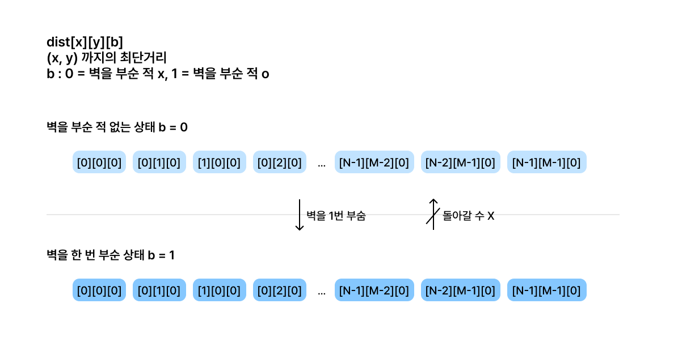
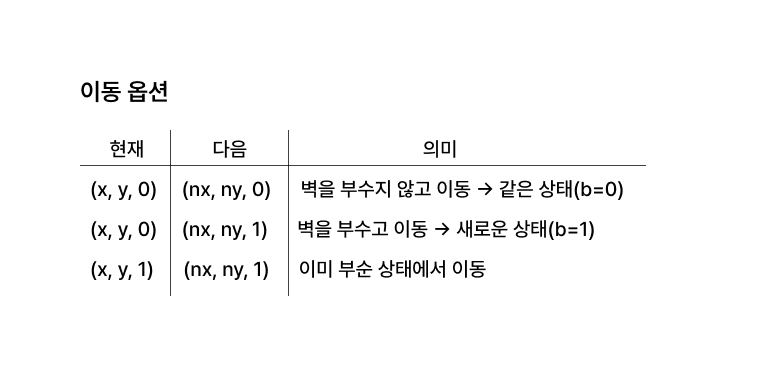
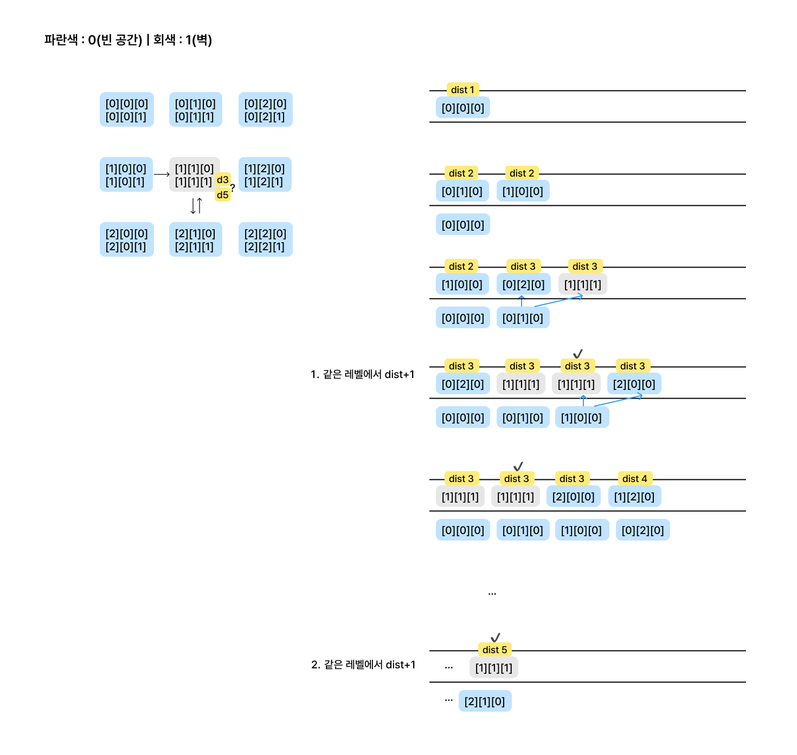
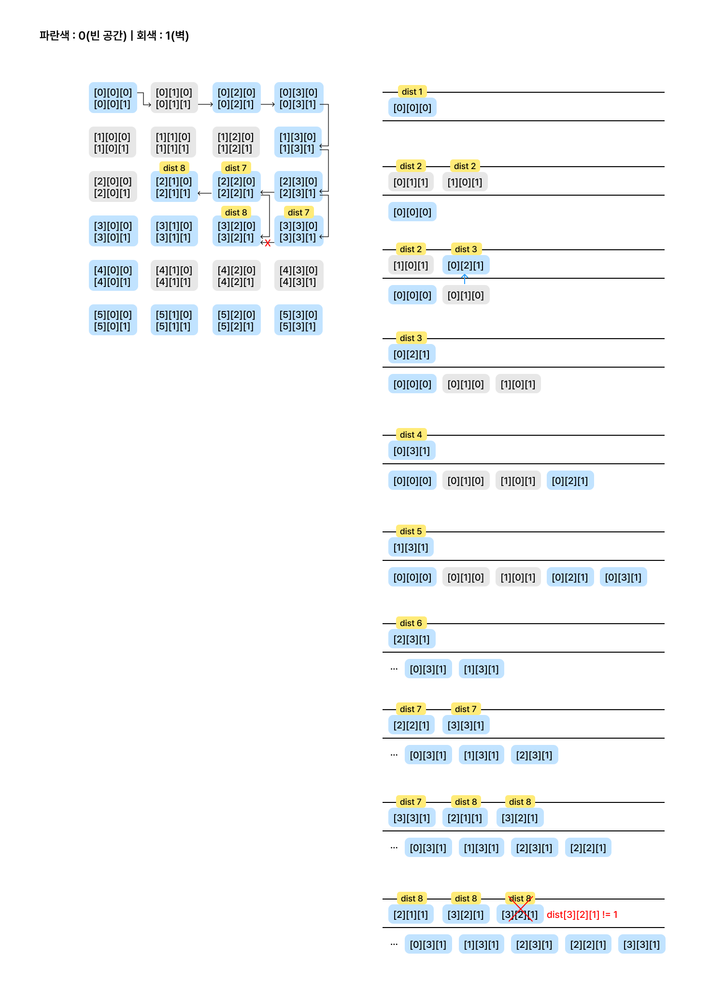
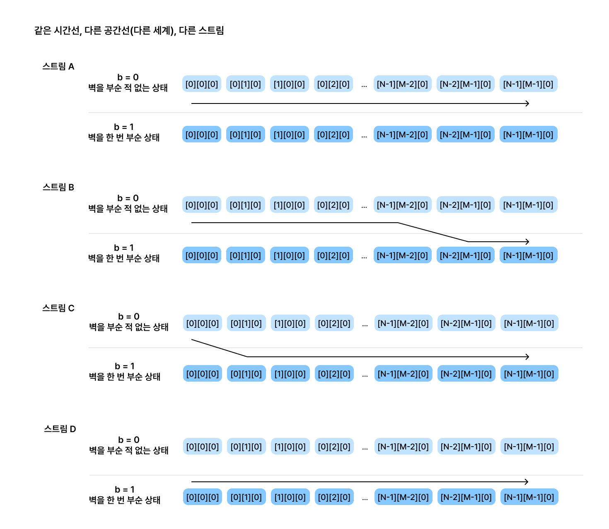
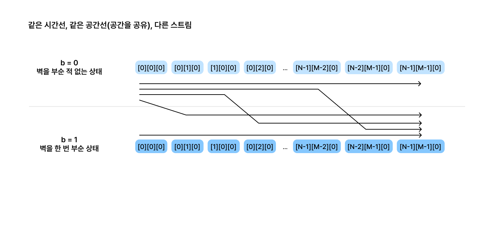

> 다 풀고 덮은 후에 갑자기 '방문 체크가 왜 오류없이 작동했을까' 하는 의문이 들었다
<br> 결론은 멀티 소스(시작점이 여러개인) BFS와 단일 소스 BFS를 헷갈려서
<br> 공간축(layer)과 시간축(leveL)을 혼동한 것이었다
> 
> 즉, ‘여러 시작점이 동시에 전파되는 상황’을 염두에 두고
<br> 단일 큐 내의 상태 확장을 잘못 해석했던 것이다.
<br> 먼저 문제를 전반적으로 설명하고 이 부분도 설명하겠다


# 설계

## 1. 문제의 컨셉
핵심적인 룰은 아래와 같다
- 연속으로 부수면 안된다(X)
- 전체 여정에서 1번만 부술 수 있다(O)

따라서 벽을 부술 수 있는 1번의 기회를 소진했는가?를 가지고 차원을 나눠 진행한다 <br>
이를 레이어로 생각하자 <br>

Layer 0 - 아직 벽을 부순 적이 없으며, 따라서 앞으로 벽을 부술 수 있는 상태 <br>
Layer 1 - 이미 벽을 한 번 부순 적이 있으며, 따라서 앞으로 벽을 부술 수 없는 상태 <br>

그리고 중요한 점은 Layer 0에서 Layer 1로 가면 복귀는 불가하다는 것이다 (단방향 전이) <br>

이렇게 생각하고 최단거리를 저장하는 배열 dist를 아래와 같이 정의한다 <br>

```java
static int[][][] dist; // dist[x][y][b]
```
b는 boolean으로(0 = 안 부숨, 1 = 부숨) <br>
b 상태로 도달했을 때의 최단거리를 dist에 저장한다
이렇게 상태를 좌표와 함께 관리한다는 것이 발상의 8할이다


그림으로 표현하면 다음과 같다


<br>

## 2. 판정의 기준 (관점)
두번째로 생각할 것이 판정의 기준(관점)이다

1. 현재 정점의 관점으로 판정
2. 미래 정점의 관점으로 판정

플레이어의 이동 옵션은 다음과 같다 <br>


위 이동 옵션을 고려하여 관점에 따른 이동 가능성을 판별한다


### 1. 현재 정점(cur)의 관점
현재 정점(cur)의 b 상태를 기준으로 이동 가능성, 다음 노드의 b(상태)를 결정한다

- cur가 x, y, 0(부순 적 x)이라면
  - nxt가 '0'(빈 칸)이라면
    <br> 이동 가능, 다음 좌표는 nx, ny, 0(안 부숨)이 된다
  - nxt가 '1'(벽)이라면
    <br> 이동 가능, 다음 좌표는 nx, ny, 1(부수고 이동)이 된다

- cur가 x, y, 1(부순 적 o)이라면
  - nxt가 '0'(빈 칸)이라면
    <br> 이동 가능, 다음 좌표는 nx, ny, 1(부순 적 o)이 된다
  - nxt가 '1'(벽)이라면
    <br> 이동 불가능


이를 구현하면 다음과 같다
```java
// 현재 정점이 부순 적 없는 세계
if (b == 0) {
    if (map[nx][ny] == 0) { // nxt가 빈 칸
        dist[nx][ny][0] = dist[x][y][0] + 1;
        q.offer(new int[]{nx, ny, 0});
    } else if (map[nx][ny] == 1) { // nxt가 벽 -> 부수고 이동
        dist[nx][ny][1] = dist[x][y][0] + 1;
        q.offer(new int[]{nx, ny, 1});
    }
}

// 현재 정점이 부순 적 있는 세계
else if (b == 1) {
    if (map[nx][ny] == 0) {
        dist[nx][ny][1] = dist[x][y][1] + 1;
        q.offer(new int[]{nx, ny, 1});
    }
}
```

### 2. 미래의 관점
다음 정점(nxt)의 map 값(0-빈 칸, 1-벽)을 기준으로 이동 가능성, b(상태)를 결정한다

- nxt가 0(빈칸)이라면 
  - 과거와 상관없이 이동 가능, cur의 b(부순 적이 있는지 없는지)를 그대로 갖고 이동한다
- nxt가 1(벽)이라면
  - 과거에 부순 적이 없는 경우에만 이동 가능, b = 0일 때만 이동할 수 있다


이를 구현하면 다음과 같다
```java
if (map[nx][ny] == 0) { // 빈 칸
    dist[nx][ny][b] = dist[x][y][b] + 1;
    q.offer(new int[]{nx, ny, b});
} else if (map[nx][ny] == 1 && b == 0) { // 벽이고 아직 안 부쉈을 때만 부수기 가능
    dist[nx][ny][1] = dist[x][y][b] + 1;
    q.offer(new int[]{nx, ny, 1});
}
```
<br>

두 관점은 결과적으로 동일하게 동작하며, 구현 방향의 차이일 뿐이다.

<br>

## 3. 방문 여부의 체크
이 부분이 내가 헷갈려서 삽질한 부분이다

```java
static int bfs() {
        Queue<int[]> q = new ArrayDeque<>();
        dist[0][0][0] = 1; // 시작점은 '0', 안 부숨(b = 0)
        q.offer(new int[]{0, 0, 0});

        while (!q.isEmpty()) {
            int[] cur = q.poll();
            int x = cur[0], y = cur[1], b = cur[2];

            if (x == N - 1 && y == M - 1) return dist[x][y][b]; // 탈출 조건

            for (int d = 0; d < 4; d++) {
                int nx = x + dx[d], ny = y + dy[d];
                if (nx < 0 || ny < 0 || nx >= N || ny >= M) continue;
                if (dist[nx][ny][b] != -1) continue; // 👈👈 방문 여부 체크

              // 중략

            }
        }
        return -1; // 도달 실패
    }
```

<br>

여기서 방문 체크의 코드는 아래의 한 줄이다
```java
if (dist[nx][ny][b] != -1) continue; // 방문 여부 체크
```
이 방문 체크 코드를 보고 현재 상태(b) 그대로에 대해서만 방문 여부를 확인한다 <br>
그렇다면 다른 상태(b')는 어떻게 처리되는걸까? <br>
다른 상태(b')에서 이미 방문한 정점은 걸러지지 않는게 아닐까?라는 의문이 들었다 <br>

예를 들어, (x, y, 0)에서 (nx, ny, 1)로 이동하려 할 때, <br>
이미 다른 경로에서 (nx, ny, 1)이 방문된 상태라면 이 조건문은 그것을 탐지하지 못한다. 그렇지 않은가?

 <br>

### A
결론부터 얘기하자면 그렇다, 탐지하지 못한다 <br>
하지만 오류가 발생하지는 않는다

이는 BFS의 "레벨 단위 탐색" 특성 때문이다 <br>

BFS는 한 레벨(깊이)씩 같은 거리(깊이)의 정점들을 동시에 확장한다 <br>
즉, 거리 n(레벨 n)의 정점들이 전부 처리(poll)된 다음에야 거리 n+1의 정점들이 처리(poll)되는 것이다 <br>

이와 같은 BFS의 “같은 시간 레벨의 전파 동시성” 때문에, <br>
BFS의 핵심 불변식 “이미 방문된 정점은, 더 짧은 거리로 방문된 적이 있는 정점이다”가 성립한다. <br>

<br>
아래 예시로 보자



### 1. 같은 레벨의 중복 삽입 
중복 방문되지만 방문이 같은 레벨에서 일어나는 경우 <br>

같은 거리의 레벨 내에서 여러번 방문이 일어나기도 한다 <br>
하지만 그 값이 항상 같은 값으로 써지기 때문에 오류가 일어나지 않는다 <br>

이는 BFS의 본질 때문이다 <br>
> “BFS는 동일한 레벨의 모든 노드가 동일한 거리 값을 가진다.” <br>

즉, 현재 poll된 (0,1,0)과 (1,0,0)의 거리 값이 같다면, 그 정점들이 만들어내는 다음 단계 (1,1,1) 의 거리 값도 항상 동일(= 현재 거리 + 1)하기 때문에
중복 방문, 큐에 중복 삽입이 되어도 값의 일관성이 유지되는 것이다.  <br>

그러나 같은 상태가 두 번 큐에 들어가기 때문에 아래처럼 방문체크를 강화할 수 있다

```java
static int bfs() {
  Queue<int[]> q = new ArrayDeque<>();
  dist[0][0][0] = 1; // 시작점은 '0', 안 부숨(b = 0)
  q.offer(new int[]{0, 0, 0});

  while (!q.isEmpty()) {
    int[] cur = q.poll();
    int x = cur[0], y = cur[1], b = cur[2];

    if (x == N - 1 && y == M - 1) return dist[x][y][b]; // 탈출 조건

    for (int d = 0; d < 4; d++) {
      int nx = x + dx[d], ny = y + dy[d];
      if (nx < 0 || ny < 0 || nx >= N || ny >= M) continue;
      if (dist[nx][ny][b] != -1) continue; // 👈 기존 방문 여부 체크

      if (map[nx][ny] == 0) { // 빈 칸
        dist[nx][ny][b] = dist[x][y][b] + 1;
        q.offer(new int[]{nx, ny, b});
      } else if (map[nx][ny] == 1 && b == 0) { // 벽이고 아직 안 부쉈을 때만 부수기 가능
        if (dist[nx][ny][1] != -1) continue; // ✅ b=1 상태로 이미 방문했다면 스킵
        dist[nx][ny][1] = dist[x][y][b] + 1;
        q.offer(new int[]{nx, ny, 1});
      }
    }
  }
  return -1; // 도달 실패
}
```
<br> 

### 2. 더 큰 값으로 덮어씌워지는 경우

(2,1,0)이 poll될 때의 인접 정점은 위, 좌, 우, 이 중 위(1,1)는 벽이고 현재의 상태는 0(벽 안 부숨)이라서 (1,1,1) 로 갈 수 있다 <br>
그런데 문제는 이전에 (0,1,0)에서 벽을 부수며 (1,1,1) 을 방문했고, 그 때 dist[1][1][1] = 3의 값이 저장됐다는 것이다 <br>

(2,1,0)에서 갈 때 dist[nx][ny][1] = dist[x][y][b] + 1; <br>
→ dist[1][1][1] = 5, 즉, 기존의 최단거리를 초과하는 값이 덮어씌워진다 <br>

왜냐면 방문 체크는 if (dist[nx][ny][b] != -1) 로만 하므로, <br>
현재의 b=0이라서 dist[1][1][0]만 검사하고 넘어가기 때문이다. <br>
(dist[1][1][1]은 검사 대상이 아님)

 <br>

하지만 이것이 논리적으로 안전한 이유는 BFS가 level order traversal이기 때문이다 <br>
dist[2][1][0]의 값은 dist[1][1][1]보다 항상 크거나 같다 <br>
나중에 큐에 들어온 (2,1,0)은 반드시 이전 (0,1,0)보다 같은 레벨이거나 더 깊은 레벨에 있다 <br>


즉, 큰 값으로의 덮어쓰기가 일어나더라도, 덮어씌워진 큰 값으로는 더 짧은 경로를 침범하지 않는다 <br>
결국 BFS의 거리 단조성(레벨 순 탐색, 단조 증가) 덕분에 논리적 오류가 일어나지 않는 것이다 <br>


하지만 이 경우 또한 큐에 중복 삽입이 일어나기 때문에 방문체크를 상태(b)에 따라 분리하는 것이 낫다 <br>
따라서 아래와 같이 방문 체크를 완전 명시적으로 수정했다

```java
static int bfs() {
  Queue<int[]> q = new ArrayDeque<>();
  dist[0][0][0] = 1; // 시작점은 '0', 안 부숨(b = 0)
  q.offer(new int[]{0, 0, 0});

  while (!q.isEmpty()) {
    int[] cur = q.poll();
    int x = cur[0], y = cur[1], b = cur[2];

    if (x == N - 1 && y == M - 1) return dist[x][y][b]; // 탈출 조건

    for (int d = 0; d < 4; d++) {
      int nx = x + dx[d], ny = y + dy[d];
      if (nx < 0 || ny < 0 || nx >= N || ny >= M) continue;
      if (dist[nx][ny][b] != -1) continue; // 👈 기존 방문 여부 체크

      if (map[nx][ny] == 0) { // 빈 칸
        if (dist[nx][ny][b] != -1) continue; // ✅ 같은 상태로 이미 방문했으면 스킵
        dist[nx][ny][b] = dist[x][y][b] + 1;
        q.offer(new int[]{nx, ny, b});
      } else if (map[nx][ny] == 1 && b == 0) { // 벽이고 아직 안 부쉈을 때만 부수기 가능
        if (dist[nx][ny][1] != -1) continue; // ✅ b=1 상태로 이미 방문했다면 스킵
        dist[nx][ny][1] = dist[x][y][b] + 1;
        q.offer(new int[]{nx, ny, 1});
      }
    }
  }
  return -1; // 도달 실패
}
```

이렇게 고친 코드로 큐를 돌려보자

<br>

2206번의 예제를 큐에 돌리는 과정으로 보자

dist 7의 [3][3][1]에서는 dist 8의 [3][2][1]로 진입하지 못한다 <br>
이미 dist 7의 [2][2][1]에서 dist 8의 [3][2][1]을 방문, 점유했고 방문 체크에서 걸러지기 때문이다 <br>

어쨌든 이건 현재와 미래의 b가 같은 상태, 즉, b = 0 -> b = 0 또는 b = 1 -> b = 1의 경우이긴 하지만 <br>
이렇게 "b가 다른 상태로 가는데 && 이미 점유되어 있는 상태 -> 그래서 이동하지 못함"을 구현했다

<br>

### 요약 : BFS의 레벨(깊이)

BFS는 큐(FIFO)를 사용하므로, 큐에 들어온 순서 = 거리 오름차순 순서가 된다 <br>
따라서 어떤 정점이 dist = 7로 방문됐다면, 이후 같은 정점에 dist = 7보다 짧은 거리로 도달하는 일은 절대 없다 <br>

정리하면 다음과 같다
- **방문 체크 → 레벨 n의 정점 A에서 레벨 n+1의 정점 X를 방문했다면 단독점유권을 얻어, 다른 정점 B는 정점 X에 방문할 수 없다**
- **BFS의 레벨 단위 탐색 → “레벨(깊이)” 단위로 탐색을 진행하기 때문에, 같은 레벨 혹은 더 짧은 경로로 먼저 방문된 노드는 다시 방문되지 않는다**
  - BFS는 큐를 이용해서 거리 1(레벨 1) → 거리 2(레벨 2) → 거리 3(레벨 3) → … 순으로 모든 노드를 탐색한다
  <br> 즉, “지금 큐에 들어있는 모든 노드들은 동일한 거리 레벨에 있다”는 게 보장된다

그래서 어떤 노드 (x, y, b)가 dist[x][y][b] = n으로 처음 방문되었다면, <br>
그건 “n이 이 상태(b)에 도달하는 최소 거리”임이 이미 증명된 것이다 <br>


## 3. BFS의 구조적 원리 : 같은 시간선 위의 다른 차원, Layer로서의 b

### 1. BFS는 병렬적 확장을 하는 탐색

BFS는 각 “선택의 갈래(스트림)”를 개별적으로 끝까지 추적하지 않는다 <br>
즉, 한 경로를 끝까지 파고드는 DFS(깊이우선탐색) 과 달리, <br>
BFS는 같은 깊이에 있어서 모든 너비를 탐색하며, 모든 스트림(경로)의 깊이를 동시에 확장한다 <br>


각 “스트림”은 특정 시점에서의 탐색 경로를 의미한다 <br>
예를 들어 (0,0,0)에서 출발해 (1,0,0)과 (0,1,0)으로 분기되면, 두 스트림 A와 B가 생겨난다 <br>
BFS에서는 이 둘을 동일한 시간선(=동일한 거리 레벨) 위에서 함께 확장한다 <br>
즉, BFS의 모든 스트림은 한 시간선 안에서 병렬적으로 실행되며, 서로 다른 레벨(깊이)를 넘어서 간섭하지 않는다 <br>

 <br>

### 2. 상태 전이 BFS의 개념 : 같은 시간선의 다른 차원

이 문제(2206)는 벽을 한 번만 부술 수 있는 상태 전이 BFS로, ‘벽을 부순 적 있는가(b)’라는 상태가 추가된 3차원 BFS다 <br>
b=0 (벽을 부순 적 없음)과 b=1 (벽을 한 번 부순 상태)의 두 상태는 서로 다른 세계가 아니라, 같은 시간선의 다른 차원(layer) 이다 <br>

즉,
- (x, y, 0)과 (x, y, 1)은 동일한 좌표이지만, 다른 상태 공간에 존재한다
- BFS는 이 두 layer를 하나의 큐에서 동시에 관리한다
- 따라서 (x, y)의 좌표는 공유되지만, (x, y, 0)과 (x, y, 1)은 논리적으로 독립된 노드이다

결과적으로 상태 전이 BFS는 2차원 평면이 아니라 (x, y, b)라는 3차원 공간을 탐색하는 셈이다

 <br>


### 3. 스레드 모델을 사용한 상태 전이 BFS의 이해


**스레드 구조**

| 유형 | 개념 | 특징 |
|---|---|---|
| 멀티프로세스 | 각 프로세스가 완전히 독립된 메모리 공간 사용 | 서로 간섭하지 않음 |
| 멀티스레드 | 스레드가 공용 자원에 접근하며 동시 실행 | 자원 충돌 방지를 위해 동기화 필요 |
| 멀티스테이트 | 한 스레드가 여러 상태 레이어를 오가며 작업 | 동일 시간선 내의 상태 병행 관리 |

 <br>

상태 전이 BFS의 스레드 구조는 무엇일까?

1. 서로 다른 시간선(스트림)을 병렬로 돌리는 것 (멀티 프로세스)
   
   스트림 각각이 서로 완전히 다른 시간선에 존재, 즉, 멀티 프로세스처럼 공간 자체를 따로 사용하는 구조

 <br>

2. 같은 시간선 안에서 여러 상태(b)를 함께 관리 (멀티 스레드)
   
   모든 스트림이 하나의 큐에서 동시 진행되는 구조(하나의 시간선) <br>

답은 2번이 맞다
- b=0 레이어와 b=1 레이어는 “같은 시간선의 다른 차원(layer)”이다
- 단일 큐에서 이 두 layer를 동시에 같이 돌린다
  즉, 이 구조는 **단일 큐 안에서 여러 상태(b)를 동시에 다루는 멀티스테이트**로, <br>
  멀티 스레드의 구조를 가진 단일 소스의 “싱글타임 멀티스테이트”라고 볼 수 있다 <br>

 <br>

이를 멀티스레드에 빗대어 이해해 보자

|  | BFS에서의 대응        | 멀티스레드에서의 대응                                      |
|---|------------------|--------------------------------------------------|
| 큐 | 전체 작업 풀          | 모든 스레드가 작업을 가져가는 스레드 풀(공유 큐)                     |
| 각 노드의 확장 | 개별 스레드의 실행       | 병렬적으로 수행되지만 공용 자원(dist)에 동기화 필요                  |
| dist 배열 | 방문 기록 테이블        | 공유 메모리                                           |
| if(dist != -1) continue | 방문 여부를 확인하고 건너 뜀 | synchronized/lock 영역 - 이미 점유된 상태면 다른 스레드의 진입을 차단 |

BFS는 여러 스레드가 한 프레임(같은 시간 단위) 내에서 각자 맡은 노드를 병렬로 처리하는 구조와 같다 <br>
이때, 서로 다른 b값의 노드들은 같은 시간선에 존재하지만 서로 다은 차원의 데이터이기 때문에 충돌하지 않는다 <br>

 <br>

### 4. BFS vs 스레드 구조 : 단일 스레드 vs 멀티 스레드 vs 멀티 프로세스 vs 멀티 스테이트

다른 BFS 모델도 스레드와 비교해 이해해 보자 

**스레드 구조와 BFS 모델의 대응**

| 구분               | 큐 개수   | 시작점            | 상태 관리        | 간섭 여부      | 모델 비유          |
|------------------|--------|----------------|--------------|------------|----------------|
| 일반 BFS(단일 소스)    | 하나의 큐  | 하나의 시작점        | 단일 상태        | 없음         | 단일 스레드         |
| 멀티소스 BFS         | 여러 큐   | 여러 개의 시작점      | 단일 상태        | 있음 (공간 겹침) | 단일 큐 다중 스레드    |
| 경쟁 BFS           | 여러 큐   | 여러 개의 시작점      | 단일 상태        | 있음(경쟁 충돌) | 멀티 프로세스        |  
| 상태 전이 BFS (2206) | 하나의 큐  | 하나의 시작점(단일 소스) | 여러 상태(b 레이어) | 없음 (dist로 충돌 방지) | 멀티스레드

<br>

**단일소스 BFS (Single-source BFS)**

가장 기본적으로 쓰는 BFS, <br>
하나의 시작점에서 출발, 하나의 큐로 탐색
단일 큐, 단일 시작점 구조

	• 큐에 처음 들어가는 원소는 1개 (start)
	• 탐색은 거리 1 → 2 → 3 순으로 확장
	• 방문 체크는 2차원 (dist[x][y])
	• 예시: 미로 탐색(2178), 최단 거리 기본 문제

<br>

**멀티소스 BFS(Multi-source BFS)**

한 시점에 여러 개의 요소가 동시에 출발하는 유형을 구현할 때 사용, <br>
여러 시작점이 하나의 큐에 동시에 들어가 시작되는 BFS, <br>
단일 큐, 다중 시작점 구조

    • 큐는 하나, 시작점이 여러 개
    • 시작점 여러 개를 초기 상태에서 한 번에 offer
    • 시작점 여러 개가 같은 시간선의 0레벨로 동시에 시작함 (즉, 동시에 전파됨)
    • 서로 다른 소스의 전파가 공간적으로 겹칠 수 있음 (간섭 발생)
    • 예시: 불이 여러 곳에서 번지는 문제 (5427 불, 7576 토마토 등)

 <br>

**경쟁 BFS(Competitive BFS)**

서로 다른 요소들이 경쟁하거나, 각자 자기 시간축에서 전파될 때 사용, <br>
여러 요소가(주체) 각자의 큐를 따로 가지고 탐색하는 BFS <br>
다중 큐, 다중 시작점 구조

    • 큐 여러 개, 시작점도 여러 개 (주체별로 따로 있음)
    • 각 주체는 자신의 큐와 시작점으로 BFS 수행
    • 전파 속도나 우선순위가 다르면, 동일 위치에 대해 경쟁 발생
    • 예시: 바이러스 확산(18405 경쟁적 전염), 팀별 전진 시뮬레이션 등

 <br>

**상태 기반 BFS**

시작점은 하나지만, 내부적으로 여러 상태(b) 를 동시에 관리 <br>
단일 큐, 단일 시작점 + 여러 레이어 구조

	• 큐는 하나, 시작점도 하나
    • 원소는 (x, y, b) 형태(3차원, b - 상태)로, 여러 상태 b를 동시에 관리
	• 각 상태는 같은 좌표라도 다른 “차원(layer)”에 존재, 이 레이어를 번갈아 탐색함
	• 공간은 공유되지만 dist[x][y][b]로 동기화되므로 (방문 체크를 하면) 충돌 없음
	• 서로 다른 상태는 같은 큐에서 동시 확장됨
	•	예시: 벽 부수고 이동하기(2206), 열쇠-문 문제(1194) 등

 <br>


### 결론
- BFS는 “시간선(level)”을 공유하며, 모든 경로(stream) 를 병렬적으로 확장한다
- (x, y, b)는 “같은 시간선 위의 다른 차원(layer)”이다
- 멀티스레드 비유로 보면, 각 큐의 원소는 하나의 스레드처럼 병렬적으로 처리되지만, dist[x][y][b]를 통해 방문 여부를 동기화하는 것이다
- 멀티소스 BFS는 서로 다른 시간선이 공간적으로 겹칠 수 있지만, 상태 전이 BFS는 한 시간선 위의 상태 전이만 존재한다

상태 전이 BFS는 한 시작점(한 큐)에서 여러 레이어(b 상태)를 동시에 확장하는 멀티스테이트형 BFS이다 <br>
서로 다른 상태는 같은 시간선 위에서 병렬로 탐색되지만, dist[x][y][b]로 동기화되어 간섭이나 중복 방문이 발생하지 않는다
 

# 구현
[🔗자바 파일로 확인 1](/14/G2206V1.java)
[🔗자바 파일로 확인 2](/14/G2206V2.java)

### 1. 현재 관점으로 구현
```java
import java.io.*;
import java.util.*;

public class G2206V1 {
  static int N, M;
  static int[][] map; // [1~N][1~M]
  static int[][][] dist; // dist[x][y][b] b->boolean(0 = 안 부숨, 1 = 부숨) b 상태로 도달했을 때의 최단거리
  static int[] dx = {-1, 1, 0, 0};
  static int[] dy = {0, 0, -1, 1};

  public static void main(String[] args) throws IOException {
    BufferedReader br = new BufferedReader(new InputStreamReader(System.in));
    StringTokenizer st = new StringTokenizer(br.readLine());
    N = Integer.parseInt(st.nextToken());
    M = Integer.parseInt(st.nextToken());

    map = new int[N][M];
    dist = new int[N][M][2];
    for (int i = 0; i < N; i++) {
      String line = br.readLine();
      for (int j = 0; j < M; j++) {
        map[i][j] = line.charAt(j) - '0';
        Arrays.fill(dist[i][j], -1);
      }
    }

    System.out.println(bfs());
  }

  static int bfs() {
    Queue<int[]> q = new ArrayDeque<>();
    dist[0][0][0] = 1; // 시작점은 '0', 안 부숨(b = 0)
    q.offer(new int[]{0, 0, 0});

    while (!q.isEmpty()) {
      int[] cur = q.poll();
      int x = cur[0], y = cur[1], b = cur[2];

      if (x == N - 1 && y == M - 1) return dist[x][y][b]; // 탈출 조건

      for (int d = 0; d < 4; d++) {
        int nx = x + dx[d], ny = y + dy[d];
        if (nx < 0 || ny < 0 || nx >= N || ny >= M) continue;
        if (dist[nx][ny][b] != -1) continue; // 같은 상태의 방문 체크

        /**
         * 현재 정점의 관점
         * cur가 x,y,0(안부숨)
         * - nxt가 '0'(빈 칸) -> nx, ny, 0(안부숨)
         * - nxt가 '1'(벽) -> nx, ny, 1(부숨)
         * cur가 x, y, 1(부숨)
         * - nxt가 '0'(빈 칸) -> nx, ny, 0(안부숨)
         * - nxt가 '1'(벽) -> 진입 불가
         */
        // 현재 정점이 부순 적 없는 세계
        if (b == 0) {
          if (map[nx][ny] == 0) { // nxt가 빈 칸
            dist[nx][ny][0] = dist[x][y][0] + 1;
            q.offer(new int[]{nx, ny, 0});
          } else if (map[nx][ny] == 1) { // nxt가 벽 -> 부수고 이동
            if (dist[nx][ny][1] != -1) continue; // 다른 상태의 방문 체크
            dist[nx][ny][1] = dist[x][y][0] + 1;
            q.offer(new int[]{nx, ny, 1});
          }
        }

        // 현재 정점이 부순 적 있는 세계
        else if (b == 1) {
          if (map[nx][ny] == 0) {
            dist[nx][ny][1] = dist[x][y][1] + 1;
            q.offer(new int[]{nx, ny, 1});
          }
        }

      }
    }
    return -1; // 도달 실패
  }
}

```

### 2. 미래 관점으로 구현
```java
import java.io.*;
import java.util.*;

public class G2206V2 {
  static int N, M;
  static int[][] map; // [1~N][1~M]
  static int[][][] dist; // dist[x][y][b] b->boolean(0 = 안 부숨, 1 = 부숨) b 상태로 도달했을 때의 최단거리
  static int[] dx = {-1, 1, 0, 0};
  static int[] dy = {0, 0, -1, 1};

  public static void main(String[] args) throws IOException {
    BufferedReader br = new BufferedReader(new InputStreamReader(System.in));
    StringTokenizer st = new StringTokenizer(br.readLine());
    N = Integer.parseInt(st.nextToken());
    M = Integer.parseInt(st.nextToken());

    map = new int[N][M];
    dist = new int[N][M][2];
    for (int i = 0; i < N; i++) {
      String line = br.readLine();
      for (int j = 0; j < M; j++) {
        map[i][j] = line.charAt(j) - '0';
        Arrays.fill(dist[i][j], -1);
      }
    }

    System.out.println(bfs());
  }

  static int bfs() {
    Queue<int[]> q = new ArrayDeque<>();
    dist[0][0][0] = 1; // 시작점은 '0', 안 부숨(b = 0)
    q.offer(new int[]{0, 0, 0});

    while (!q.isEmpty()) {
      int[] cur = q.poll();
      int x = cur[0], y = cur[1], b = cur[2];

      if (x == N - 1 && y == M - 1) return dist[x][y][b]; // 탈출 조건

      for (int d = 0; d < 4; d++) {
        int nx = x + dx[d], ny = y + dy[d];
        if (nx < 0 || ny < 0 || nx >= N || ny >= M) continue;

        /**
         * nxt가 빈 칸
         * - b(부순지 안부순지의 여부) 갖고 그대로 이동
         *
         * nxt가 벽
         * - b = 0(부순적 x)일 때만 이동
         */
        if (map[nx][ny] == 0) { // 빈 칸
          if (dist[nx][ny][b] != -1) continue; // 같은 상태의 방문 체크
          dist[nx][ny][b] = dist[x][y][b] + 1;
          q.offer(new int[]{nx, ny, b});
        } else if (map[nx][ny] == 1 && b == 0) { // 벽이고 아직 안 부쉈을 때만 부수기 가능
          if (dist[nx][ny][1] != -1) continue; // 상태 변경시의 방문 체크 b=0 -> b=1
          dist[nx][ny][1] = dist[x][y][b] + 1;
          q.offer(new int[]{nx, ny, 1});
        }
      }
    }
    return -1; // 도달 실패
  }
}

```