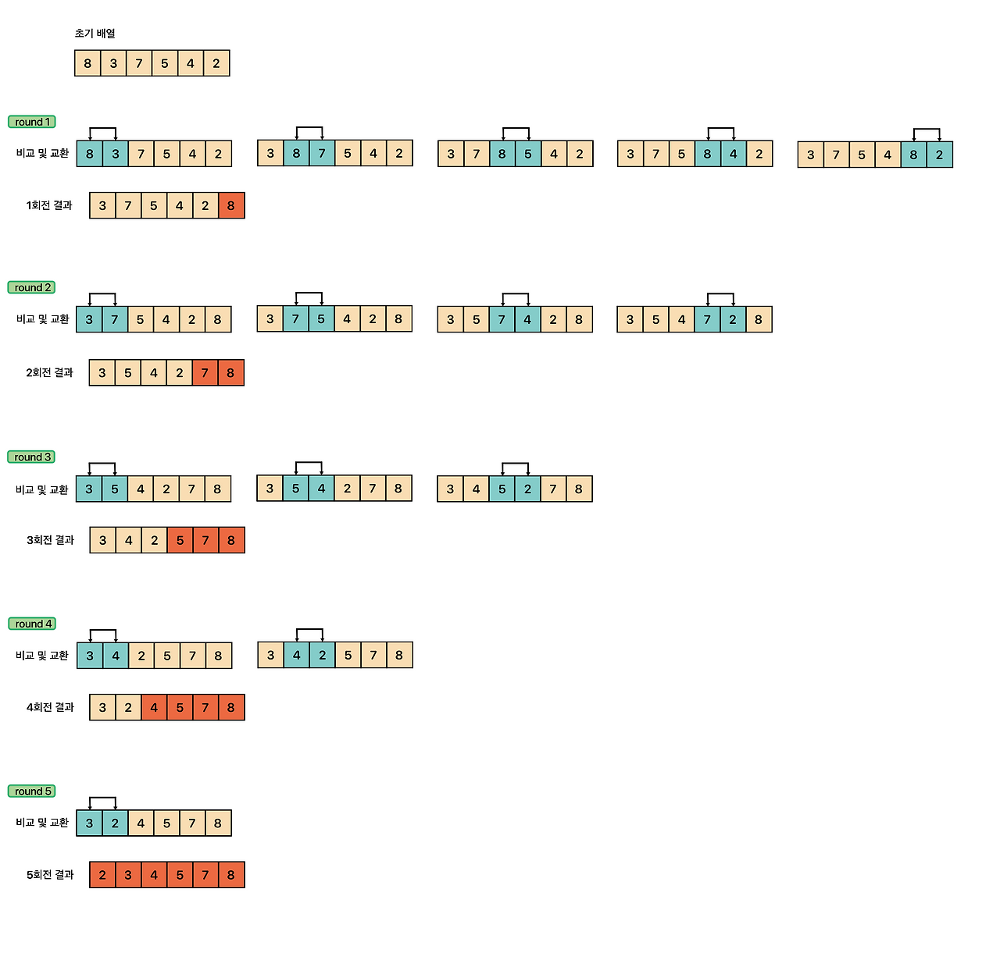

### [✏️ 정렬 이론](/topics/09_sorting/sorting.md)
- [선택 정렬 Selection Sort](/topics/09_sorting/selection_sort.md)
- [버블 정렬 Bubble Sort](/topics/09_sorting/bubble_sort.md)
- [삽입 정렬 Insertion Sort](/topics/09_sorting/insertion_sort.md)
- [퀵 정렬 Quick Sort](/topics/09_sorting/quick_sort.md)
- [병합 정렬 Merge Sort](/topics/09_sorting/merge_sort.md)
- [힙 정렬 Heap Sort](/topics/09_sorting/heap_sort.md)
- [계수 정렬 Counting Sort](/topics/09_sorting/counting_sort.md)
### [📁 정렬 문제 리스트](/topics/09_sorting/09_sorting.md)


# 버블 정렬 Bubble Sort

[참고한 블로그](https://st-lab.tistory.com/195)

> 서로 인접한 버블이 터지는 것처럼 인접한 두 원소를 비교해 큰 값을 뒤로 밀어내는 정렬 알고리즘  
> 한 라운드가 끝날 때마다 가장 큰 원소가 맨 뒤로 고정된다


## 개념



- 인접한 두 원소 `(a[j], a[j+1])` 를 비교, **앞의 값이 크면 swap**
- 한 라운드가 끝나면 **가장 큰 값이 맨 뒤로 이동**
- 다음 라운드에서는 전 라운드에서 맨 뒤로 정렬된 요소를 제외하고 반복
  <br> → 한 라운드마다 비교해야 할 원소가 하나씩 차감됨
- 위 라운드를 `배열의 크기 - 1` 만큼 반복
- 제자리 정렬(in-place): 정렬의 대상이 되는 데이터 외에 추가 공간이 필요하지 않아 추가 메모리를 사용하지 않음


### 동작 과정

| 라운드 | 비교 구간     | 설명               |
|-----|-----------|------------------|
| 1   | [0]~[N-2] | 가장 큰 값이 맨 뒤로     |
| 2   | [0]~[N-3] | 두 번째로 큰 값이 그 앞에  |
| ... | ...       | ...              |
| N-2 | [0]~[1]   | 뒤에서 두번째로 큰 값이 뒤로 |
| N-1 | [0]       | 끝                |

- 라운드가 1턴 종료될 때마다 더 큰 수 하나가 판별되어 뒤로 감
- 그 다음부터는 이미 판별된 큰 수를 제외하고 비교하면 됨
  <br> ⇒ 각 라운드별 비교횟수 = `배열 크기 - 라운드 회차`
  - ex. arr[6]이면 5번 비교
- 총 라운드 : `배열 크기 - 1` (라운드 1번마다 더 큰 값 하나가 뒤쪽에 박히니까)
- 총 반복 횟수 = `N(N-1)/2`
- 따라서 시간복잡도는 **O(N²)**


### 시간 복잡도

| 케이스 | 복잡도 | 설명 |
|---------|---------|------|
| 평균 | O(N²) | 모든 원소를 반복 비교 |
| 최악 | O(N²) | 역순 정렬일 때 |
| 최선 | O(N) | 이미 정렬되어 있고 swap이 한 번도 발생하지 않을 때 |
| 공간복잡도 | O(1) | 제자리 정렬 |

<br>

## 구현

```java
public class Bubble_Sort {
 
	public static void bubble_sort(int[] a) {
		bubble_sort(a, a.length);
	}
	
	private static void bubble_sort(int[] a, int size) {
		
		// round는 배열 크기 - 1 만큼 진행됨. 1부터 size -1까지(총 size-1번의 라운드)
		for(int i = 1; i < size; i++) {
			
			// 각 라운드별 비교횟수는 배열 크기의 현재 라운드를 뺀 만큼 비교함
			for(int j = 0; j < size - i; j++) { // 각 라운드별로 총 size-i번 비교함
				
				/*
				 *  현재 원소가 다음 원소보다 클 경우
				 *  서로 원소의 위치를 교환한다. 
				 */
				if(a[j] > a [j + 1]) {
					swap(a, j, j + 1);
				}
			}
		}
	}
	
	private static void swap(int[] a, int i, int j) {
		int temp = a[i];
		a[i] = a[j];
		a[j] = temp;
	}
}
```

<br>

## 변형 버블 정렬 - swap 여부 체크

한 라운드에서 비교수행을 할 때 한 번도 swap(원소가 교환)이 일어나지 않는다면,

이는 이미 정렬된 데이터라는 의미이기 때문에 정렬을 종료한다

즉, 각 라운드에서 비교수행을 했는지를 판단할 수 있는 boolean 변수를 하나 두면 되는 것이다.

- 시간 복잡도 : O(n)

```java
public class Bubble_Sort {
 
	public static void bubble_sort(int[] a) {
		bubble_sort(a, a.length);
	}
	
	private static void bubble_sort(int[] a, int size) {
		
		// round는 배열 크기 - 1 만큼 진행됨 
		for(int i = 1; i < size; i++) {
        
			boolean swapped = false;	
			
			// 각 라운드별 비교횟수는 배열 크기의 현재 라운드를 뺀 만큼 비교함
			for(int j = 0; j < size - i; j++) {
				
				/*
				 *  현재 원소가 다음 원소보다 클 경우
				 *  서로 원소의 위치를 교환하고
				 *  비교수행을 했다는 표시로 swapped 변수를 true로 변경한다.
				 */
				if(a[j] > a [j + 1]) {
					swap(a, j, j + 1);
					swapped = true;
				}
			}
            
			/*
			 * 만약 swap된적이 없다면 이미 정렬되었다는 의미이므로
			 * 반복문을 종료한다. 
			 */
			if(swapped == false) {
				break;
			}
		}
	}
	
	private static void swap(int[] a, int i, int j) {
		int temp = a[i];
		a[i] = a[j];
		a[j] = temp;
	}
}
```

<br>

## 요약

| 항목 | 설명                   |
|---|----------------------|
| 정렬 방식 | 비교 정렬                |
| 안정성 | ✅ 같은 값의 순서 유지        |
| 제자리 정렬 | ✅ 추가 공간 불필요          |
| 장점 | 구현이 간단, 직관적          |
| 단점 | 비교 횟수가 많아 큰 데이터엔 부적합 |
| 개선 | swap 감지로 O(N)까지 줄일 수 있음 |


### 코테 활용

기초 구현 문제, 정렬 로직을 직접 코딩하는 문제에서 자주 등장
