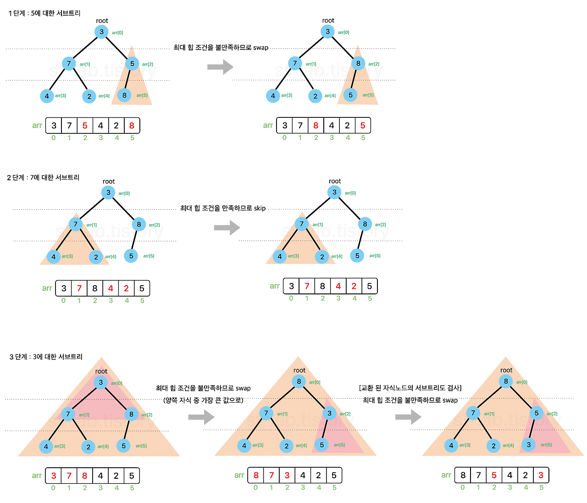

### [✏️ 정렬 이론](/topics/09_sorting/sorting.md)
- [선택 정렬 Selection Sort](/topics/09_sorting/selection_sort.md)
- [버블 정렬 Bubble Sort](/topics/09_sorting/bubble_sort.md)
- [삽입 정렬 Insertion Sort](/topics/09_sorting/insertion_sort.md)
- [퀵 정렬 Quick Sort](/topics/09_sorting/quick_sort.md)
- [병합 정렬 Merge Sort](/topics/09_sorting/merge_sort.md)
- [힙 정렬 Heap Sort](/topics/09_sorting/heap_sort.md)
- [계수 정렬 Counting Sort](/topics/09_sorting/counting_sort.md)
### [📁 정렬 문제 리스트](/topics/09_sorting/09_sorting.md)

# 힙 정렬 Heap Sort

[참고 블로그](https://st-lab.tistory.com/225)

> 완전이진트리 기반의 힙(Heap) 자료구조를 이용해 정렬하는 알고리즘 <br>
> 최대 힙(Max Heap) 으로 오름차순 정렬, 최소 힙(Min Heap) 으로 내림차순 정렬을 구현할 수 있다


### 배경 지식 - 이진트리, 힙

- 이진 트리, 힙 설명

  <이진 트리>

    ```java
        10
       /  \
      5    8
    ```

    - **각 노드가 최대 2개의 자식만 가질 수 있는 구조**

  <완전 이진 트리>

    ```java
        1
       / \
      2   3
     / \
    4   5
    ```

    - 이진 트리 중에서도 **왼쪽부터 차곡차곡 빈칸 없이 채운 트리**

  <힙, 완전 힙>

    ```java
         9           // 최대 힙
       /   \
      7     6
     / \   /
    5   4 2
    ```

    ```java
         1           // 최소 힙
       /   \
      3     2
     / \   /
    5   4 6
    ```

  **완전 이진 트리 + 특별한 규칙이 있는 구조**

    - 최대 힙
        - 부모는 항상 자식보다 크거나 같음
        - 제일 위(root)가 제일 큰 값
    - 최소 힙
        - 부모는 항상 자식보다 작거나 같음
        - 제일 위(root)가 제일 작은 값


## 힙 정렬 개념
    
### 힙

힙은 **'최솟값 또는 최댓값을 빠르게 찾아내기 위해 완전이진트리 형태로 만들어진 자료구조'**

힙의 성질

- 부모 노드는 항상 자식 노드보다 우선순위가 높다.
- **최대 힙**은 **부모 노드의 값 >= 자식 노드의 값**이다.
- 인덱스
    - 가장 마지막 노드의 인덱스 = `size - 1`
    - 가장 마지막 노드의 부모 노드의 인덱스 = `(size - 1)-1 / 2`

    1. 왼쪽 자식 노드 인덱스 = `부모 노드 인덱스 × 2 + 1`

    2. 오른쪽 자식 노드 인덱스 =`부모 노드 인덱스 × 2 + 2`

    3. 부모 노드 인덱스 = `(자식 노드 인덱스 - 1) / 2` (int로 몫만 취하면 됨)


### 힙 정렬

1. 배열을 `최대 힙`으로 만든다 (힙 생성 알고리즘) ⇒ $O(nlogn)$
   → root 노드가 항상 최댓값을 가지도록 만듦
    - 힙은 부모노드가 자식노드보다 우선순위가 높음(형제노드 간 우선순위는 고려x).
      즉, “반 정렬 상태”로, 완전 정렬 상태는 x
    - 🤨왜 최소 힙으로 안만드는가? - 형제노드 간 우선순위는 고려하지 않기 때문
2. [정렬] 가장 큰 수( = `최대 힙`이므로 root노드)를 꺼내서 맨 뒤로 보낸다
3. 맨 뒤로 보낸 수를 제외하고 남은 수로 다시 `최대 힙`을 만든다(Heapify)
4. 위 과정(2~3)을 반복하면 오름차순 정렬이 됨

즉, `최대 힙`을 만들고 root 노드에 있는 숫자를 맨 뒤로 보냄

→ 맨 뒤에 보낸 숫자를 제외하고 남은 숫자들에 대해 다시 `최대 힙`을 구성함

→ 다시 최댓값(root)을 맨 뒤로 보내고 제외, 남은 숫자들에 대해 `최대 힙`을 구성

위 과정을 반복, 매 과정마다 (맨 뒤에 짱박히는)최댓값을 제외하다 보면  오름차순 정렬이 완성됨


###  Heapify

**`Heapify` 설명**

- 부모노드부터 자식노드로 진행되는 sift-down 과정
    - 지정된 서브트리로 힙화 시작
    - 변경이 일어났다면 재귀 호출로자식 서브트리도 힙화 수행..> 이 과정을 반복
- 한 노드 기준 서브트리에 대해서만 heap 구조를 만들음
1. parentIdx 부모노드의 인덱스로 왼쪽 자식노드와 오른쪽 자식노드의 인덱스를 계산
   largestIdx(최댓값의 인덱스)는 parentIdx(부모노드의 인덱스)로 일단 초기화해놓음
2. 그후 왼쪽 자식노드와 오른쪽 자식노드 각각 largestIdx와 비교해서 largestIdx보다 크면 largestIdx에 해당 자식 노드의 인덱스를 저장
3. 마지막에 largestIdx가 처음 초기화하며 저장했던 parentIdx와 일치하는지 체크, **일치하지 x**

   → 자식노드 중 부모노드보다 큰 값이 있었다는 뜻이므로

   → 해당 largestIdx와 부모노드를 swap ⇒ 부모 노드와 최댓값을 가졌던 자식노드의 값이 스왑됨

   → 그 후 largestIdx(최댓값을 가졌던 자식 노드)를 부모노드로 하는 서브트리를 검사하도록 재귀 호출.

### Heap Sort - Max Heap 만드는 과정



    sort(a, a.length)
    └─ 1단계: Max Heap 생성 (한 번만 수행)
        └─ 아래에서 위로 각 부모 노드마다 heapify(i)
            └─ heapify(i): 해당 서브트리를 최대 힙으로 변환 (Top-down)
    └─ 2단계: 정렬 시작 (i = size-1 ~ 1)
        └─ 루트값(최댓값)을 맨 뒤로 보내고
        └─ 남은 범위(0~i-1)에 대해 heapify(0)

- 이 과정(max heap을 만드는 건) 처음 한번만 실행됨
- 가장 첫 번째로 검사하는 노드는 <**가장 마지막 노드의 부모노드의 서브트리>**
- 모든 **부모 노드를 시작점으로** 각 서브트리를 힙 조건으로 맞춰서 최종적으로 전체 트리를 max heap으로 만들음


- sort의 heapify 호출에선 아래→위로 각 부모 노드에 대해 heapify호출

  ⇒ 최종적으로 전체 트리에 대해 max heap을 구성

  `for(int i = parentIdx; i >= 0; i--)`

    - 가장 마지막 노드의 부모 노드를 parentIdx로 하는 서브트리에 대해 heapify 시작
    - 거슬러 올라가며 root에 닿을 때까지 heapify를 실행
- heapify 내부에선 해당 서브트리를 max heap으로 변환함(위→아래로)
    - 더 이상 서브트리가 없는 리프노드일 경우? 어차피 a[largestIdx] < a[leftChildIdx] 또는 a[largestIdx] < a[rightChildIdx] 의 경우가 생기지 않으니 변경도 안 일어남. 안전

**`Heap sort - 정렬 과정`** 설명

- root 원소를 배열의 맨 뒤로 보냄 → 맨 뒤로 보낸 원소를 제외하고 나머지에 대해 다시 max heap으로 재구성 ⇒ 이 과정을 반복하면 최댓값이 계속 뒤에 짱박힘 ⇒ 오름차순 정렬 완료

그 다음 오름차순 정렬에서는 heapify를 돌리는 범위(끝 범위)를 줄여가며 인덱스 0부터 검사를 계속하는 것

<br>

## 구현

```java
public class HeapSort {
 
	public static void sort(int[] a) {
		sort(a, a.length);
	}
	
	private static void sort(int[] a, int size) {
 
		/*
		 * 부모노드와 heaify과정에서 음수가 발생하면 잘못 된 참조가 발생하기 때문에
		 * 원소가 1개이거나 0개일 경우는 정렬 할 필요가 없으므로 바로 함수를 종료한다.
		 */
		if(size < 2) {
			return;
		}
 
		/*
		 * left child node = index * 2 + 1
		 * right child node = index * 2 + 2
		 * parent node = (index - 1) / 2
		 */
		
		// 가장 마지막 요소의 부모 인덱스 
		int parentIdx = getParent(size - 1);
		
		// max heap 생성하기. 처음에 딱 한번 일어남
		for(int i = parentIdx; i >= 0; i--) {
			heapify(a, i, size - 1);
		}
 
		
		// 정렬 단계
		for(int i = size - 1; i > 0; i--) {
			
			/*
			 *  root인 0번째 인덱스와 i번째 인덱스의 값을 교환해준 뒤
			 *  0 ~ (i-1) 까지의 부분트리에 대해 max heap을 만족하도록
			 *  재구성한다.
			 */
			swap(a, 0, i); // root와 i를 스왑
			heapify(a, 0, i - 1); // 사이즈는 1 줄이고(맨 뒤에 보낸 최댓값 제외) 0(root)부터 max heap 만들기
		}
		
	}
	
	
	// 부모 인덱스를 얻는 함수
	private static int getParent(int child) {
	    return (child - 1) / 2;
	}
 
	// 두 인덱스의 원소를 교환하는 함수
	private static void swap(int[] a, int i, int j) {
		int temp = a[i];
		a[i] = a[j];
		a[j] = temp;
	}
	
	// 힙을 재구성 하는 함수
	private static void heapify(int[] a, int parentIdx, int lastIdx) {
		
		/*
		 * 현재 트리에서 부모 노드의 자식노드 인덱스를 각각 구해준다.
		 * 현재 부모 인덱스를 가장 큰 값을 갖고있다고 가정한다.
		 */
		int leftChildIdx = 2 * parentIdx + 1;
		int rightChildIdx = 2 * parentIdx + 2;
		int largestIdx = parentIdx; // 가장 큰 값을 가진 노드의 인덱스
		
		/*
		 *  left child node와 비교
		 *  
		 *  자식노드 인덱스가 트리의 크기를 넘어가지 않으면서(트리에 존재하는 인덱스라는 말)
		 *  현재 가장 큰 인덱스(부모노드)보다 왼쪽 자식노드의 값이 더 클경우
		 *  가장 큰 인덱스를 가리키는 largestIdx를 왼쪽 자식노드인덱스로 바꿔준다.
		 *  
		 */
		if(leftChildIdx <= lastIdx && a[largestIdx] < a[leftChildIdx]) {
			largestIdx = leftChildIdx;
		}
		// 만약 서브트리의 부모노드가 리프노드라면 -> ChildIdx는 lastIdx보다 크므로(배열을 초과하므로 false. 뒷 조건은 검사하지 않음) <자바의 단락 평가 SCE>
		
		/*
		 *  right child node와 비교
		 *  
		 *  자식노드 인덱스가 트리의 크기를 넘어가지 않으면서
		 *  현재 가장 큰 인덱스보다 오른쪽 자식노드의 값이 더 클경우
		 *  가장 큰 인덱스를 가리키는 largestIdx를 오른쪽 자식노드인덱스로 바꿔준다.
		 *  
		 */
		if(rightChildIdx <= lastIdx && a[largestIdx] < a[rightChildIdx]) {
			largestIdx = rightChildIdx;
		}
		
		/*
		 * largestIdx 와 부모노드가 같지 않다는 것은
		 * 위 자식노드 비교 과정에서 현재 부모노드보다 큰 노드가 존재한다는 뜻이다.
		 * 그럴 경우 해당 자식 노드와 부모노드를 교환해주고,
		 * 교환 된 자식노드를 부모노드로 삼은 서브트리를 검사하도록 재귀 호출 한다.
		 */
		if(parentIdx != largestIdx) {
			swap(a, largestIdx, parentIdx); // 가장 큰 값의 노드의 인덱스와 부모노드의 값을 스왑
			heapify(a, largestIdx, lastIdx); // 큰 값이 있던 자식 노드의 인덱스를 부모로 다시 heapify
		}
	}
}
```


<br>

## 요약

| 항목     | 설명                  |
|--------|---------------------|
| 정렬 방식  | 비교 정렬               |
| 안정성    | ❌ (불안정 정렬)          |
| 제자리 정렬 | ✅ (O(1) 추가 메모리만 사용) |
| 시간 복잡도 | O(N log N)          |
| 공간 복잡도 | O(1) |

- 정렬 기준 : 두 부분 리스트의 첫 원소부터 비교, 작은 값을 먼저 복사
- 기준 선택 : 중간 인덱스 (퀵 소트는 피벗으로, 왼쪽/오른쪽/중간 피벗 선택)
- 정렬 방식 : 정렬 후 병합 (퀵 소트는 분할 후 정렬)
- 보조 배열의 사용 : sorted[] 임시 배열에 병합 결과 저장 후 원본 a[]로 복사


### 코테 활용

K번째 수, Top-K, 정렬 구현 문제에 자주 등장
