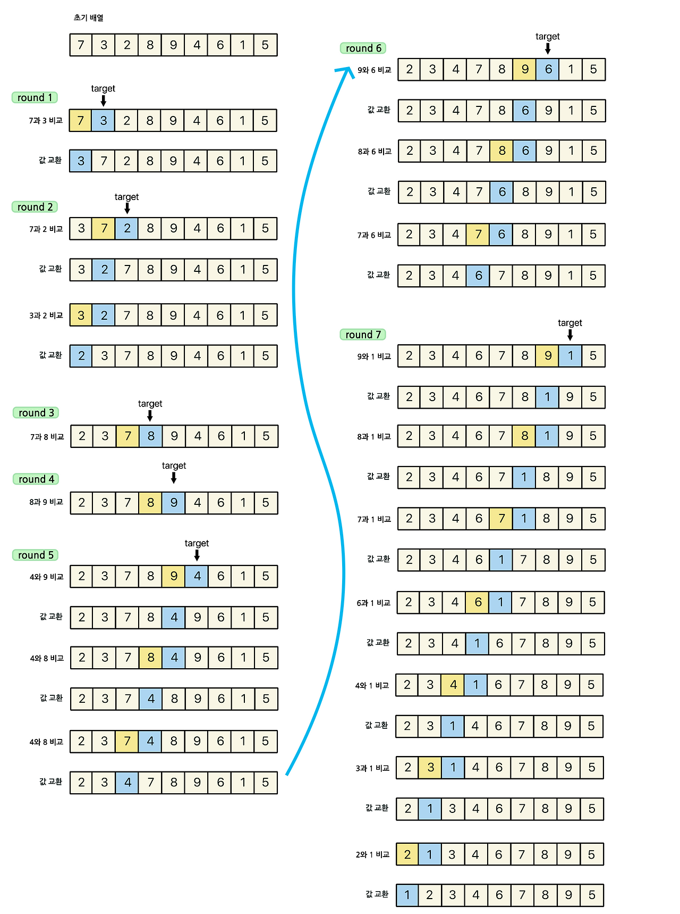

### [✏️ 정렬 이론](/topics/09_sorting/sorting.md)
- [선택 정렬 Selection Sort](/topics/09_sorting/selection_sort.md)
- [버블 정렬 Bubble Sort](/topics/09_sorting/bubble_sort.md)
- [삽입 정렬 Insertion Sort](/topics/09_sorting/insertion_sort.md)
- [퀵 정렬 Quick Sort](/topics/09_sorting/quick_sort.md)
- [병합 정렬 Merge Sort](/topics/09_sorting/merge_sort.md)
- [힙 정렬 Heap Sort](/topics/09_sorting/heap_sort.md)
- [계수 정렬 Counting Sort](/topics/09_sorting/counting_sort.md)
### [📁 정렬 문제 리스트](/topics/09_sorting/09_sorting.md)


# 삽입 정렬 Insertion Sort

[참고한 블로그](https://st-lab.tistory.com/179)

> 이미 정렬된 앞 구간을 탐색하여 “현재 타겟의 자리를 찾아 삽입”해 배열을 점진적으로 완성하는 정렬 알고리즘  
> **왼쪽 부분은 항상 정렬되어 있다**는 가정 하에 동작한다.


> 타겟 원소의 앞 배열을 검사,
<br> 앞 배열의 요소들이 타겟이 더 큰 동안 : 타겟보다 큰 수는 뒤로 밀고,
<br> 타겟이 앞 배열의 요소보다 크면 : 타겟을 그 자리에 주차(삽입)


## 개념



- **타겟(target)**: 현재 차례의 원소
- **왼쪽 구간은 항상 정렬된 상태라고 가정함**
- 타겟보다 **큰 원소들은 뒤로 한 칸씩 밀고**, 타겟보다 **작은 원소를 만나면 그 자리에 삽입(주차)**
- 즉, “타겟보다 큰 애들은 뒤로 밀기 → 자리를 찾으면 삽입”


### 동작 과정

| 단계 | 설명 |
|------|------|
| ① | 현재 인덱스(i)의 원소를 타겟으로 선택 |
| ② | 타겟 앞쪽의 정렬된 구간을 역순으로 탐색 |
| ③ | 타겟보다 큰 원소는 뒤로 한 칸씩 밀기 |
| ④ | 타겟보다 작은 원소를 만나면 그 뒤에 삽입 |
| ⑤ | 다음 인덱스로 넘어가 반복 |

💡 첫 번째 원소(인덱스 0)는 비교 대상이 없으므로 건너뛰고 두 번째 원소부터 시작한다.

- **타겟과 (이미 정렬이 끝난)앞 구간의 원소들을 맨 앞에서부터 하나씩 비교하면서** 
  - `target < a[j]` : 타겟보다 큰 수가 있으면 뒤로 밀기
  - `target >= a[j]` : 타겟이 비교숫자보다 더 큼 → 타겟은 그보다 앞으로 갈 수 없음. 거기에 주차
- **처음으로 타겟보다 “작은 원소”를 만나면**, 그 위치가 바로 **타겟이 들어갈 자리**


- 이미 정렬되어 있는 경우 → 시간 복잡도 : O(n)
- 내림차순으로 정렬되어 있는 경우 → 총 비교횟수 = 1 + 2 + … + (N-1) → 시간 복잡도 : O($n^2$)
- 평균 시간 복잡도 : O($n^2$)

### 시간 복잡도

| 케이스 | 복잡도 | 설명 |
|---------|---------|------|
| 평균 | O(N²) | 일반적인 경우 |
| 최악 | O(N²) | 역순 정렬 상태 |
| 최선 | O(N) | 이미 정렬된 상태 |
| 공간복잡도 | O(1) | 제자리 정렬 (in-place) |

<br>

## 구현
````java
public class Insertion_Sort {
 
	public static void insertion_sort(int[] a) {
		insertion_sort(a, a.length);
	}
	
	private static void insertion_sort(int[] a, int size) {
		
		
		for(int i = 1; i < size; i++) { // 0(첫번째)이 아닌 1부터 n-1(끝)까지 라운드를 돈다
			
			int target = a[i]; // 타겟 넘버
			
			int j = i - 1; // 타겟 앞전의 인덱스
			
			// 밀기 : 타겟이 이전 원소보다 크기 전 까지 반복
			// 범위 : 타겟 앞전의 인덱스부터 시작, 인덱스[0]에 갈 때까지 감소
			while(j >= 0 && target < a[j]) { // 1. 비교 : 타겟이 앞에 있는 비교원소보다 작으면
				a[j + 1] = a[j];	 // 2. 앞 원소를 한 칸씩 뒤로 미룬다. 
				                   //    앞 원소를 뒷 인덱스의 자리에 대입.
				j--;               // 3. j를 감소시킴. 이 서클을 인덱스[0]에 갈 때까지 반복
			}
			
			/*
			 * 위 반복문에서 탈출 하는 경우 앞의 원소가 타겟보다 작다는 의미이므로 a[j] < target
			 * 타겟 원소는 j번째 원소 뒤에 와야한다.
			 * 그러므로 타겟은 j + 1 에 위치하게 된다.
			 */
			 // 타겟 숫자 삽입. 드디어 주차
			a[j + 1] = target; // 타겟 숫자를 대입	
		}
		
	}
}
````

**동작 예시**
```java
a = [5, 3, 4, 1]
    [0][1][2][3]

▶ i = 1 (타겟 = 3)
	•	3은 앞의 숫자 5보다 작음 → 5를 뒤로 민다
	•	→ [5, 5, 4, 1] (임시 상태)
	•	→ 그리고 3을 그 자리에 넣는다 → [3, 5, 4, 1]

▶ i = 2 (타겟 = 4)
	•	4 < 5 → 5를 민다 → [3, 5, 5, 1]
	•	3 < 4 → 멈춤 → 4를 그 자리에 삽입 → [3, 4, 5, 1]

▶ i = 3 (타겟 = 1)
	•	1 < 5 → 5 민다 → [3, 4, 5, 5]
	•	1 < 4 → 4 민다 → [3, 4, 4, 5]
	•	1 < 3 → 3 민다 → [3, 3, 4, 5]
	•	끝 → 1 삽입 → [1, 3, 4, 5] 정렬 완료
```

<br>

## 요약
| 항목 | 설명                           |
|---|------------------------------|
| 정렬 방식 | 비교 정렬                        |
| 안정성 | ✅ (같은 값의 순서 유지)              |
| 제자리 정렬 | ✅ 추가 공간 불필요                  |
| 장점 | 데이터가 거의 정렬돼 있으면 매우 빠름        |
| 단점 | 전체 비교 시 O(N²)으로, 큰 데이터에는 부적합 |


### 코테 활용

“정렬 구현 문제”에서 자주 등장 (단순 + 직관적)
