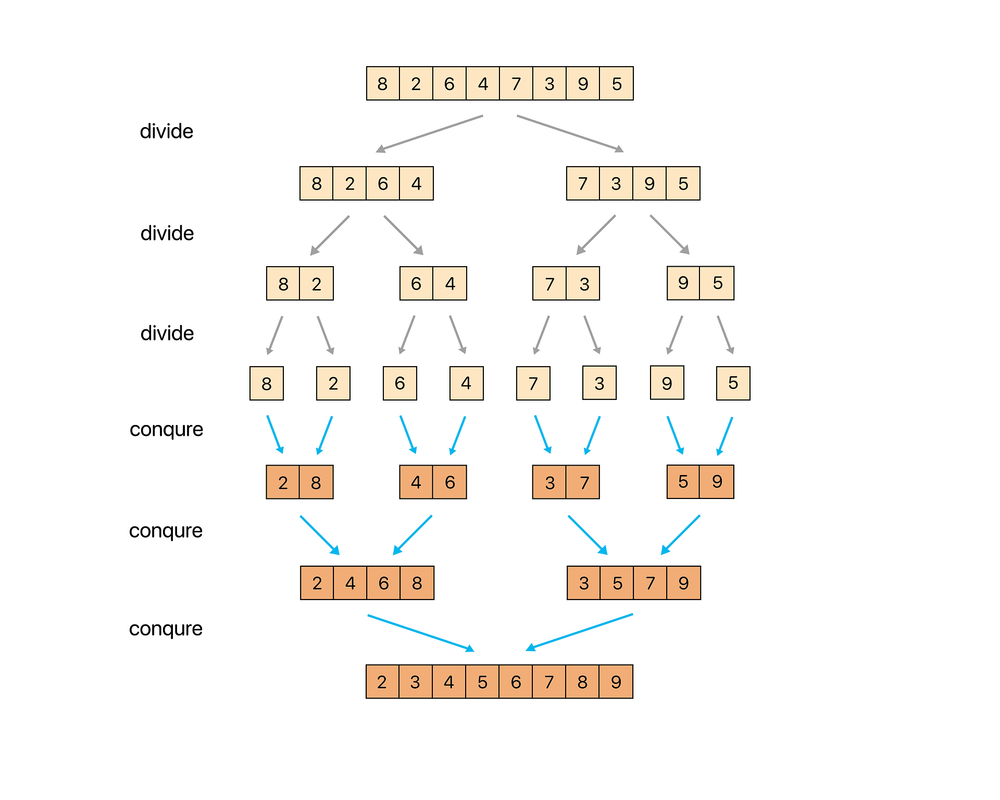

### [✏️ 정렬 이론](/topics/09_sorting/sorting.md)
- [선택 정렬 Selection Sort](/topics/09_sorting/selection_sort.md)
- [버블 정렬 Bubble Sort](/topics/09_sorting/bubble_sort.md)
- [삽입 정렬 Insertion Sort](/topics/09_sorting/insertion_sort.md)
- [퀵 정렬 Quick Sort](/topics/09_sorting/quick_sort.md)
- [병합 정렬 Merge Sort](/topics/09_sorting/merge_sort.md)
- [힙 정렬 Heap Sort](/topics/09_sorting/heap_sort.md)
- [계수 정렬 Counting Sort](/topics/09_sorting/counting_sort.md)
### [📁 정렬 문제 리스트](/topics/09_sorting/09_sorting.md)


# 병합 정렬 Merge Sort

[참고한 블로그](https://st-lab.tistory.com/233)

> 부분으로 쪼개어 정렬한 후, 합친다

## 개념



- 분할 정복(Divide and Conquer) 기반 알고리즘
- 리스트를 더 이상 쪼갤 수 없을 때까지 반으로 분할(divide)
- 그리고 두 부분을 정렬된 상태로 병합(merge)

### 과정

| 단계 | 설명 | 함수 |
|---|---|---|
| 1. 분할 (Divide) | 배열을 반으로 계속 나눔 | merge_sort(a, left, mid) / merge_sort(a, mid+1, right) |
| 2. 정복 (Conquer) | 부분 배열이 길이 1이 되면 종료 | if (left == right) return |
| 3. 결합 (Combine) | 두 정렬된 배열을 병합 | merge(a, left, mid, right) |

<br>

### 아이디어

```java
/**
 * 부분리스트는 a배열의 left ~ right 까지이다. 
 * 
 * @param a		정렬할 배열
 * @param left	배열의 시작점
 * @param mid	배열의 중간점
 * @param right	배열의 끝 점
 */
private static void merge(int[] a, int left, int mid, int right) {
	int l = left;		// 왼쪽 부분리스트 시작점
	int r = mid + 1;	// 오른쪽 부분리스트의 시작점 
	int idx = left;		// 채워넣을 배열의 인덱스
	
	
	while(l <= mid && r <= right) {
		/*
		 *  왼쪽 부분리스트 l번째 원소가 오른쪽 부분리스트 r번째 원소보다 작거나 같을 경우
		 *  왼쪽의 l번째 원소를 새 배열에 넣고 l과 idx를 1 증가시킨다.
		 */
		if(a[l] <= a[r]) {
			sorted[idx] = a[l];
			idx++;
			l++;
		}
		/*
		 *  오른쪽 부분리스트 r번째 원소가 왼쪽 부분리스트 l번째 원소보다 작거나 같을 경우
		 *  오른쪽의 r번째 원소를 새 배열에 넣고 r과 idx를 1 증가시킨다.
		 */
		else {
			sorted[idx] = a[r];
			idx++;
			r++;
		}
	}
		
	/*
	 * 왼쪽 부분리스트가 먼저 모두 새 배열에 채워졌을 경우 (l > mid)
	 * = 오른쪽 부분리스트 원소가 아직 남아있을 경우
	 * 오른쪽 부분리스트의 나머지 원소들을 새 배열에 채워준다.
	 */
	if(l > mid) {
		while(r <= right) {
			sorted[idx] = a[r];
			idx++;
			r++;
		}
	}
		
	/*
	 * 오른쪽 부분리스트가 먼저 모두 새 배열에 채워졌을 경우 (r > right)
	 * = 왼쪽 부분리스트 원소가 아직 남아있을 경우
	 * 왼쪽 부분리스트의 나머지 원소들을 새 배열에 채워준다.
	 */
	else {
		while(l <= mid) {
			sorted[idx] = a[l];
			idx++;
			l++;
		}
	}
	
	/*
	 * 정렬된 새 배열을 기존의 배열에 복사하여 옮겨준다.
	 */
	for(int i = left; i <= right; i++) {
		a[i] = sorted[i];
	}
}
```

<br>

## 구현
```java
private static int[] sorted;		// 합치는 과정에서 정렬하여 원소를 담을 임시배열

public static void merge_sort(int[] a) {

	sorted = new int[a.length];
	merge_sort(a, 0, a.length - 1);
	sorted = null;
}

// Top-Down 방식 구현
private static void merge_sort(int[] a, int left, int right) {

	/*
	 *  left==right 즉, 부분리스트가 1개의 원소만 갖고있는경우
	 *  더이상 쪼갤 수 없으므로 return한다.
	 */
	if(left == right) return;

	int mid = (left + right) / 2;	// 절반 위치

	merge_sort(a, left, mid);		// 절반 중 왼쪽 부분리스트(left ~ mid)
	merge_sort(a, mid + 1, right);	// 절반 중 오른쪽 부분리스트(mid+1 ~ right)

	merge(a, left, mid, right);		// 병합작업

}

/**
 * 합칠 부분리스트는 a배열의 left ~ right 까지이다.
 *
 * @param a		정렬할 배열
 * @param left	배열의 시작점
 * @param mid	배열의 중간점
 * @param right	배열의 끝 점
 */
private static void merge(int[] a, int left, int mid, int right) {
	int l = left;		// 왼쪽 부분리스트 시작점
	int r = mid + 1;	// 오른쪽 부분리스트의 시작점
	int idx = left;		// 채워넣을 배열의 인덱스


	while(l <= mid && r <= right) {
		/*
		 *  왼쪽 부분리스트 l번째 원소가 오른쪽 부분리스트 r번째 원소보다 작거나 같을 경우
		 *  왼쪽의 l번째 원소를 새 배열에 넣고 l과 idx를 1 증가시킨다.
		 */
		if(a[l] <= a[r]) {
			sorted[idx] = a[l];
			idx++;
			l++;
		}
		/*
		 *  오른쪽 부분리스트 r번째 원소가 왼쪽 부분리스트 l번째 원소보다 작거나 같을 경우
		 *  오른쪽의 r번째 원소를 새 배열에 넣고 r과 idx를 1 증가시킨다.
		 */
		else {
			sorted[idx] = a[r];
			idx++;
			r++;
		}
	}

	/*
	 * 왼쪽 부분리스트가 먼저 모두 새 배열에 채워졌을 경우 (l > mid)
	 * = 오른쪽 부분리스트 원소가 아직 남아있을 경우
	 * 오른쪽 부분리스트의 나머지 원소들을 새 배열에 채워준다.
	 */
	if(l > mid) {
		while(r <= right) {
			sorted[idx] = a[r];
			idx++;
			r++;
		}
	}

	/*
	 * 오른쪽 부분리스트가 먼저 모두 새 배열에 채워졌을 경우 (r > right)
	 * = 왼쪽 부분리스트 원소가 아직 남아있을 경우
	 * 왼쪽 부분리스트의 나머지 원소들을 새 배열에 채워준다.
	 */
	else {
		while(l <= mid) {
			sorted[idx] = a[l];
			idx++;
			l++;
		}
	}

	/*
	 * 정렬된 새 배열을 기존의 배열에 복사하여 옮겨준다.
	 */
	for(int i = left; i <= right; i++) {
		a[i] = sorted[i];
	}
}

```


<br>

## 요약

| 항목     | 설명                              |
|--------|---------------------------------|
| 정렬 방식  | 비교 정렬                           |
| 안정성    | ✅ 같은 값의 상대적 순서가 유지됨             |
| 제자리 정렬 | ❌ 추가 공간 필요(보조 배열)               |
| 시간 복잡도 | O(N log N) (항상 일정, 최선·평균·최악 동일) |
| 공간 복잡도 | O(N) 보조 배열이 필요                  |

- 정렬 기준 : 두 부분 리스트의 첫 원소부터 비교, 작은 값을 먼저 복사
- 기준 선택 : 중간 인덱스 (퀵 소트는 피벗으로, 왼쪽/오른쪽/중간 피벗 선택)
- 정렬 방식 : 정렬 후 병합 (퀵 소트는 분할 후 정렬)
- 보조 배열의 사용 : sorted[] 임시 배열에 병합 결과 저장 후 원본 a[]로 복사


### 코테 활용

K번째 수, Top-K, 정렬 구현 문제에 자주 등장
