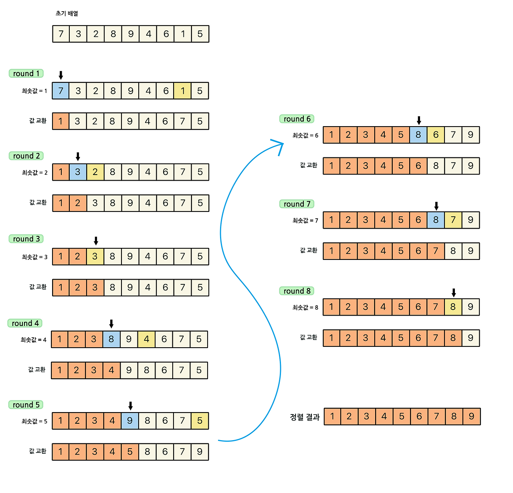

### [✏️ 정렬 이론](/topics/09_sorting/sorting.md)
- [선택 정렬 Selection Sort](/topics/09_sorting/selection_sort.md)
- [버블 정렬 Bubble Sort](/topics/09_sorting/bubble_sort.md)
- [삽입 정렬 Insertion Sort](/topics/09_sorting/insertion_sort.md)
- [퀵 정렬 Quick Sort](/topics/09_sorting/quick_sort.md)
- [병합 정렬 Merge Sort](/topics/09_sorting/merge_sort.md)
- [힙 정렬 Heap Sort](/topics/09_sorting/heap_sort.md)
- [계수 정렬 Counting Sort](/topics/09_sorting/counting_sort.md)
### [📁 정렬 문제 리스트](/topics/09_sorting/09_sorting.md)


## 선택 정렬 Selection Sort
[참고한 블로그](https://st-lab.tistory.com/168)

> 가장 작은 원소를 선택해서 맨 앞으로 보내는 알고리즘


## 개념



- 타겟 인덱스(i)를 기준으로, **i 이후의 요소 중 최솟값**을 찾아 **i와 교환(swap)**
- 타겟 앞의 배열은 이미 정렬되어 있음이 보장됨
- 즉, **정렬되지 않은 부분에서 최솟값을 선택 → 앞쪽에 배치**

### 동작 과정

- `[i] vs [i+1] ~ [N-1]` 비교
- 다음 인덱스 ~ 마지막 인덱스까지 비교해서 그 다음으로 최소인 최솟값을 앞으로 보냄
- $(N-1) + (N-2) + (N-3) … + 1 = N(N+1)/2$
- 시간 복잡도 O($n^2$)

  | i (기준) | 비교 구간 | 동작 |
  |-----------|-----------|------|
  | 0 | [1] ~ [N-1] | 전체 중 최솟값 찾아 [0]과 교환 |
  | 1 | [2] ~ [N-1] | 다음 최소값 찾아 [1]과 교환 |
  | 2 | [3] ~ [N-1] | 반복… |
  | N-2 | [N-1] | 마지막 비교 |


### 시간 복잡도

| 케이스 | 복잡도 | 설명 |
|---------|---------|------|
| 평균 | O(N²) | 항상 전체 탐색 필요 |
| 최선 | O(N²) | 이미 정렬돼 있어도 전체 비교 수행 |
| 최악 | O(N²) | 역순이어도 동일 |
| 공간복잡도 | O(1) | 제자리(in-place) 정렬 |

<br>

## 구현

```java
public class Selection_Sort {
 
	public static void selection_sort(int[] a) {
		selection_sort(a, a.length);
	}
	
	private static void selection_sort(int[] a, int size) {
		
		for(int i = 0; i < size - 1; i++) { // 배열의 전체 길이 - 1
																				// i = 회차별 탐색이 이뤄지는 범위의 앞의 값이 됨
			int min_index = i;	// min_index 세팅. 초기값은 맨 처음 인덱스로
			
			// 최솟값을 갖고있는 인덱스 찾기 
			for(int j = i + 1; j < size; j++) { // i 다음부터 배열의 끝까지 탐색
				if(a[j] < a[min_index]) { // 새로운 최솟값을 발견하면
					min_index = j; // 인덱스를 바꿈
				}
			}
			
			// i번째 값과 찾은 최솟값을 서로 교환 
			swap(a, min_index, i);
		}
	}
	
	private static void swap(int[] a, int i, int j) {
		int temp = a[i];
		a[i] = a[j];
		a[j] = temp;
	}
}
```

<br>

**예시 비교 흐름**
```java
 i  vs  j
[0] vs [1], [2], [3], [4]
[1] vs [2], [3], [4]
[2] vs [3], [4]
[3] vs [4]
```

<br>

## 요약
| 항목 | 설명                |
|---|-------------------|
| 정렬 방식 | 비교 정렬             |
| 안정성 | ❌ 같은 값의 순서가 바뀔 수 있음 |
| 제자리 정렬 | ✅ 추가 공간 불필요       |
| 장점 | 구현이 간단, 데이터 이동 횟수 적음 |
| 단점 | 비교 횟수가 많아 큰 데이터엔 비효율적 |


### 코테 활용

“직접 구현” 문제에서 자주 등장 (기초 정렬 구현 문제)
