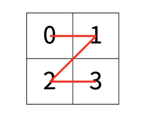
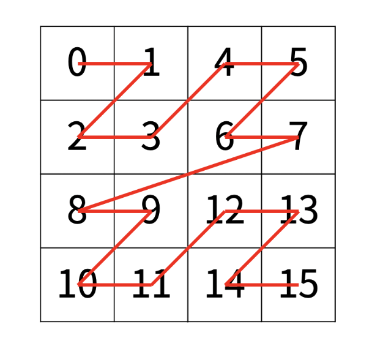

### [📁 재귀 문제 리스트](/topics/11_recursion/11_recursion.md)

# 재귀(recursion)

## 재귀란?
함수 func이 자기 안에서 함수 func을 호출, 그 func이 또 안에서 func을 호출…하는 것으로

반복문을 자기 자신의(함수) 호출로 바꾼 것이다

### 주요 요소
- **기저 조건, base case**: 더 이상 나눌 수 없는 경우. 이게 없으면 재귀는 무한 루프 돔
- **작게 나누기**: n → n-1, 범위 줄이기, 트리 구조로 분기 등
- **결과를 합치기**: 보통 return 할 때 +, *, min, max, &&, || 이런 식으로 쓴다
- 핵심은 **탈출 조건 + 호출 흐름을 정확히 설계**하는 것

분할하고 → 정복하는 분할정복의 패턴이다
<br> : 큰 문제를 작은 문제로 쪼개고, 작은 문제들의 해결 결과를 조합해서 큰 문제를 해결하는 방식


## 귀납적 사고

```java
void func1(int n) {
    if (n ==0) return;
    System.out.print(n + " ");
    func1(n-1);
}
```

### 절차지향적 사고
func1(3)을 호출했을 때

func1(3) : 3 출력, func1(2) 호출 <br>
func1(2) : 2 출력, func1(1) 호출 <br>
func1(1) : 1 출력 <br>

이렇게 생각하지 말고


### 귀납적 사고
1. P(1)이 성립
- fun1(1) -> 1 출력<br>

2. P(n)이 성립하면 P(n+1)이 성립
- func1(k+1) -> func1(k) 호출
- func1(k) -> k, k-1, k-2, ... , 1을 출력 <br>
  => func1(k+1) -> k+1 부터 1까지 차례대로 출력한다

결론 : n에 대해 P(n)이 성립 <br>
=> func1(n)은 n부터 1까지 차례대로 출력함

    1에 대해 성립함
    k에 대해 성립하면 k+1에 대해서도 성립함
    
    이 둘이 확인되면
    => '모든 n에 대해 성립한다'로 확장
이런 귀납적 사고로 재귀 문제를 풀어야 한다

복잡도가 깊어질수록 절차지향적으로 생각하려고 하면 무간지옥에 빠지기 때문이다

<br>

## 재귀 함수의 조건
- 특정 입력에 대해서는 자기 자신을 호출하지 않고 종료되어야 함(기저 조건, base case/condition)
- 모든 입력은 이 base case로 수렴해야 함

이 두 조건이 모두 성립해야 무한 루프, 런타임 에러가 발생하지 X

```java
void func1(int n) {
    if (n ==0) return;
    System.out.print(n + " ");
    func1(n-1);
}
```

위 코드에서 n == 0일 때 호출없이 종료,
모든 입력은 n == 0일 때로 수렴 <- base condition

<br>

## 재귀의 특징

### 1. 함수의 형태를 명확하게 정의해야 함
   - 함수의 인자로 어떤 것을 받고, 어디까지 계산한 후 자기 자신에게 넘겨줄지 명확하게 정해야 함
     <br>-> 함수의 형태를 잡는 연습


### 2. 모든 재귀 함수는 반복문만으로도 동일한 동작을 하는 함수를 만들 수 있음
   - 재귀 구조 없이 반복문으로 동일한 동작을 하는 함수로 변환이 가능


### 3. 재귀는 반복문으로 구현했을 때에 비해 코드는 간결하지만 함수의 호출 때문에 메모리/시간에서는 손해임
   - 따라서 반복문만으로 구현하는데 무리가 없다면 반복문현로 구현, 재귀없이는 코드가 너무 복잡하다면 재귀로 구현
   -> 언제 반복문 쓰고 언제 재귀 쓸지 감을 잡자


### 4. 한 함수가 자기 자신을 여러 번 호출하게 되면 비효율적일 수 있음

```java
int fibonacci(int n) {
        if (n <= 1) return 1;
        return fibonacci(n - 1) + fibonacci(n - 2);
    }
```
````
         5
       /   \
      4     3
    /  \   /  \
   3   2   2   1
````

-> 이와 같이 이미 계산한 것을 또 계산, O((1.618..)^n)의 시간 복잡도 발생
<br> -> (DP의 메모이제이션을 사용하면 (O(n))으로 해결 가능)

### 5. 스택 오버플로우 주의

⇒ 재귀는 알고리즘 자체가 재귀 묶음일 때 또는 콜스택이 많이 일어나지 않는 범위일 때 사용한다

재귀함수가 자기 자신을 호출할 때 스택 영역에 계속 누적되고, 이로 인한 런타임 에러가 발생할 수 있음

함수를 호출하는 건 "콜스택"에 쌓이고, 지역변수 같은 것들도 스택에 쌓임

따라서 스택 메모리가 작고(백준은 메모리 스택에 대한 별도 메모리 제한 없음) && 재귀를 깊게 들어가는 코드라면

반복문으로 대체하는 게 좋다

<br>

꼭 재귀 문제가 아니더라도 런타임 에러가 난다면

재귀가 깊지 않은지, int[2000][2000] 과 같이 지역변수에 메모리를 과하게 쓴건 아닌지 뜯어봐야 한다

int가 400만 개 -> 16MB 


### 6. 재귀가 끝나는 지점을 명확하게 구현해야 한다

안그럼 무한루프 걸림

<br>

## 그외 유의할점

- **쪼갤 때(분할) 크기 계산 실수 안 하기** (size/2 같은 규칙성 찾기)
- **기저 조건(base condition)을 상황에 맞게 세팅하기**
- **탑다운/바텀업 흐름**에 맞게 구조 잡기

<br>

## 재귀 설계 방법

1. 언제 끝낼지(base case) → **기저 조건**은 무엇인가? (종료 시점)
2. 어떻게 줄일지(sub-problem) → **작게 쪼갤 수 있는 규칙**은? (어떻게 자기자신을 호출할 수 있나)
3. 결과를 어떻게 합칠지(combine) → **쪼개진 결과를 어떻게 합칠 것인가?** (return 문)

| **상황** | **팁** |
| --- | --- |
| **탈출 조건 설정** | depth, index, i > N, start > end 등 **범위 끝을 기준으로** |
| 재귀 전에 할 일 | 위에서부터 순차적으로 출력, 누적 계산 등 |
| 재귀 후에 할 일 | 거꾸로 결과 누적, 역순 출력 등 |
| 백트래킹 필요 | visited[], arr[], 리스트 등 상태 복구를 꼭 해줘야 함 |
| DP랑 섞일 때 | dp[i]에 결과 저장 → 다음에 오면 바로 리턴해서 중복 제거 |
| 출력 문제일 때 | StringBuilder, 들여쓰기 ("____".repeat(depth)) 자주 씀 |

<br>

## 언제 쓰는가? ~~유형~~ 이라기보단 시그널(?)

- **문제가 “자기 자신을 호출”하는 듯한 구조일 때**
- 문제 설명에 "어떤 조건이면 다시 같은 문제를 푼다"거나 "작은 조각으로 나눠서 반복한다"일 때
- 반복문으로 짜면 **상태 관리를 너무 많이 해야 할 때**
- **트리 구조**, **순열/조합/부분집합**, **백트래킹**, **DP 탑다운** 계열이면 99% 재귀 가능

<br>

## 구현(템플릿)

```java
// 함수 정의
int recur(int n) {
    if (기저 조건) return 정답; // ① base case: 반드시 있어야 함!

    // ② 재귀 호출로 문제 축소
    return recur(더 작은 문제);
}
```
<br>


## 대표 예시


### 1. 거듭 제곱

**$a^b mod m$** 

```java
int func1 (int a, int b, int m) {
    int val = 1;
    while (b--) val *= a;
    return val % m;
}
```
a * a * a * ... * a(b번) 구하고,
<br> % m
<br> ?

이렇게 구현하면 **int 오버플로우** 발생! 값이 버려져서 원하는 결과 안 나옴

↓

```java
long func1(long a, long b, long m) {
    long val = 1;
    while (b-- > 0) {
        val = (val * a) % m;  // 중간마다 mod 처리
    }
    return val;
}
```
거듭 제곱을 곱하는 중간에(한 번 곱할 때마다) 
<br> 계속 mod m해서 나머지만 챙기고 버려주면 됨 -> O(b)

이렇게 해도 오버플로우 때문에 값이 정확하게 안나온다(버려진다) -> BigInteger 사용

<br>

그런데 만약에 b가 20억이라면? 이 정도로는 안된다

다음 문제를 풀며 보완해보자

<br>

**백준 #1629번 곱셈**

[🔗문제 링크 | 백준 #1629 곱셈](https://www.acmicpc.net/problem/1629)

$a^n * a^n = a^{2n}$

$12^{58} = 4(mod 67) -> 12^{116} = 16(mod67)$

위 법칙을 사용하기 위해 귀납법을 적용하면 다음과 같다

    1승을 계산할 수 있다
    k승을 계산했으면 2k승(짝수)과 2k+1승(홀수)도 계산할 수 있다 O(1)
    따라서 a^n을 귀납적으로 계산할 수 있다 
k승 -> $12^{58} = 4(mod 67)$을 계산하면 

2k승 -> $12^{116} = 16(mod67)$도 계산할 수 있고

2k+1승 -> $12^{116} = 16(mod67)$에 a를 한번만 더 곱해주면 계산할 수 있음

=> $a^n$을 구할 수 있다

<br>
이를 구현하면 다음과 같다

```java
long pow(long a, long b, long m) {
    if (b == 1) return a % m;   // base case
    long val = pow(a, b/2, m);
    val = (val * val) % m;          // 제곱 후 mod
    if (b % 2 == 0) return val;     // b가 짝수면 그대로 반환
    return val * a % m;           // 홀수면 a 한 번 더 곱함
}
```
b가 계속해서 1/2로 줄어들기 때문에 시간 복잡도는 O(log b)이다

<br>


### 2. 하노이 탑

[🔗문제 링크 | 백준 #11729 하노이 탑 이동 순서](https://www.acmicpc.net/problem/11729)

문제를 풀기 전에 앞서 아래 링크에 들어가서 룰을 익히자

[🔗 하노이 탑 게임](https://www.mathsisfun.com/games/towerofhanoi.html)

    [하노이 탑 룰지]
    - 원판은 더 작은 원판 위에 놓일 수 없음 -끝

<br>

일단 목표를 나눠보자 (귀납적 사고)

1. 1개의 원판에 대해서 성립함 => 이미 증명됨
2. (n-1)개의 원판에 대해서 성립하면 n개의 원판에 대해서도 성립함
<br> => 원판이 k개일 때 옮길 수 있으면 원판이 k+1개일 때도 옮길 수 있다
3. 모든 n에 대해 성립(귀납적 결론)

<br>

따라서 2번의 "(n-1)개의 원판을 원하는 곳으로 옮길 수 있으면 -> n개의 원판을 원하는 곳으로 옮길 수 있다"를 보이자

목표 : (n-1)개의 원판이 원하는 곳에 정렬되어 있을 때 n개의 원판을 정렬된 상태로, 기둥 3에 옮기기

    (엄밀하게는 시작 상태에 (n-1)개의 원판이 기둥 3에 있어야 하지만 넘어가자)

       -
      ---
     -----
    -------
     기둥 1         기둥 2         기둥 3

<br>

1. n번보다 작은 원판은 기둥 3에 가면 안됨 -> 1 ~ n-1번의 (n-1)개의 원판을 기둥 2에 옮김

                         -
                        ---
                       -----
        -------
         기둥 1         기둥 2         기둥 3

2. n번 원팔을 기둥 3에 옮김

                         -
                        ---
                       -----
                                    -------
         기둥 1         기둥 2         기둥 3


3. 1 ~ n-1번의 (n-1)개의 원팔을 기둥 3에 옮김

                                       -
                                      ---
                                     -----
                                    -------
         기둥 1         기둥 2         기둥 3

<br>

이를 구현해보자

1. 함수의 정의
    ```java
    void func(int n) {} // 원판 n개를 기둥 1에서 기둥 3으로 옮기는 방법을 출력하는 함수 
    ```
   => 1 ~ n-1의 원판을 기둥 2로 옮겨야 하므로 func(n-1)으로 재활용 불가
   <br><br>
     ```java
    void func (int a, int b, int n) {} // 원판 n개를 a번 기둥에서 b번 기둥으로 옮기는 방법을 출력하는 함수 
    ```
   => 출발 기둥과 도착 기둥도 인자로 받도록 해서 해결

2. base case
   
    n = 1일 때 a번 기둥에서 b번 기둥으로 옮기기
    ```java
    System.out.println(a + " " + b + "\n");
    ```

    n = 0일 때를 base case로 두면 어떨까? - 너나 생각해

<br>

3. 재귀 식

a도 b도 아닌 기둥의 번호는 (6-a-b) (기둥의 번호를 모두 더하면 1+2+3=6)

출발 기둥 : a, 도착 기둥 : b, 보조 기둥 : 6-a-b

- n-1개의 원판을 기둥 a에서 기둥 6-a-b로 옮긴다
    ```java
    func(a, 6-a-b, n-1);
    ```
- n번 원판을 기둥 a에서 기둥 b로 옮긴다
    ```java
    System.out.println(a + " " + b + "\n");
    ```
- n-1개의 원판을 기둥 6-a-b에서 기둥 b로 옮긴다
    ```java
    func(6-a-b, b, n-1);
    ```

4. 추가 요구사항) 총 옮긴 횟수

원판 K개를 옮기기 위해 A번의 이동이 필요

원판 K+1개를 옮기는데에는
- 원판 K개를 빈 곳에 옮기기 위해 A번
- K+1번 원반을 옮기기 위해 1번
- 원판 K개를 다시 목적지로 옮기기 위해 A번

총 2A+1번의 이동이 필요

초항이 1이므로 이 수열의 일반항은 $2^k - 1$이 된다 <br>
<< 하지만 하노이탑이 유명해서 물어보는거지 코테에서 일반적으로 이런 지식을 요구하지는 않기 때문에 넘기자

<br>

**전체 코드**

```java
import java.io.*;
import java.util.*;

public class Main {

    static void func(int a, int b, int n) { // 출발 기둥, 도착 기둥, 옮길 원판의 개수
        if (n == 1) {
            System.out.println(a + " " + b);
            return;
        }

        func(a, 6 - a - b, n - 1);  // ① 출발 → 보조 기둥으로 n-1개 이동
        System.out.println(a + " " + b); // ② 가장 큰 원판 이동
        func(6 - a - b, b, n - 1);  // ③ 보조 → 목표 기둥으로 n-1개 이동
    }

    public static void main(String[] args) throws IOException {
        BufferedReader br = new BufferedReader(new InputStreamReader(System.in));
        int k = Integer.parseInt(br.readLine());

        System.out.println((1 << k) - 1); // 이동 횟수 = 2^k - 1, 1<<k : 2진수 1을 k칸 왼쪽으로 밀기
        func(1, 3, k); // 1번 기둥 → 3번 기둥으로 k개의 원판 이동
    }
}
```

<br>

### 3. Z
[🔗문제 링크 | 백준 #1074 Z](https://www.acmicpc.net/problem/1074)



<br>


> [룰지] 
> <br> 크기가 2^N × 2^N인 2차원 배열을 Z모양으로 탐색
> <br> N > 1인 경우, 배열을 크기가 2N-1 × 2N-1로 4등분 한 후에 재귀적으로 순서대로 방문
> <br> N이 주어졌을 때, r행 c열을 몇 번째로 방문하는지 출력하는 프로그램을 작성하라


재귀적으로 사고하기

1. N = 1일 때 시작점이 (0,0), (0,0) -> (0,1) -> (1,0) -> (1,1) 순으로 방문
2. N = k 일 때 -> 2^k * 2^k을 4등분 해서 2^(k-1)*2^(k-1)로 쪼개고 왼위 -> 오위 -> 왼아래 -> 오아래 순으로 방문
<br> N = k+1일 때 -> 2^(k+1) * 2^(k+1)을 4등분 해서 2^k*2^k로 쪼개고 왼위 -> 오위 -> 왼아래 -> 오아래 순으로 방문

=> 따라서 N에 대해 이 룰이 성립함 

이를 구현해보자

1. 함수의 정의
   ```java
   int recur (int r, int c, int n) {} // 2^n * 2^n 배열에서 (r, c)를 방문하는 순서
   ```

2. base condition
   n = 0일 때 return 0; 

3. 재귀식
   > 1-왼위, 2-오위, 3-왼아래, 4-오아래 라고 할 때
   <br> (r, c)가 1번 사각형에 위치 -> return func (n-1, r, c) ;
   <br> (r, c)가 2번 사각형에 위치 -> return half*half + func(n-1, r, c-half) ;
   <br> (r, c)가 3번 사각형에 위치 -> return 2*half*half + func(n-1, r-half, c) ;
   <br> (r, c)가 4번 사각형에 위치 -> return 3*half*half + func(n-1, r-half, c-half);


**구현**

```java
import java.io.*;
import java.util.*;

public class G1704 {
    public static void main(String[] args) throws IOException {
        BufferedReader br = new BufferedReader(new InputStreamReader(System.in));
        StringTokenizer st = new StringTokenizer(br.readLine());
        int N = Integer.parseInt(st.nextToken());
        int r = Integer.parseInt(st.nextToken());
        int c = Integer.parseInt(st.nextToken());

        System.out.println(recur(N, r, c));
    }

    // 2^N × 2^N 배열에서 (r, c)의 방문 순서를 찾는 함수
    static int recur(int n, int r, int c) { // 목표 r행, c열, 배열의 크기 2^n*2^n
        if (n == 0) return 0; // base condition

        int half = 1 << (n - 1); // (int)Math.pow(2, n - 1) 보다 빠름

        if (r < half && c < half) return recur(n - 1, r, c);
        else if (r < half && c >= half) return half * half + recur(n - 1, r, c - half);
        else if (r >= half && c < half) return 2 * half * half + recur(n - 1, r - half, c);
        else return 3 * half * half + recur(n - 1, r - half, c - half);
    }
}
```

<br><br>

### 4. 피보나치

```java
int fibo(int n) {
    if (n == 1 || n == 2) return 1;            // ① 기저 조건
    return fibo(n - 1) + fibo(n - 2);           // ② 작은 문제 2개로 분할
}
```

피보나치 재귀의 실제 흐름

```java
fibo(4)
= fibo(3) + fibo(2)
= (fibo(2) + fibo(1)) + (fibo(1) + fibo(0))= ((fibo(1) + fibo(0)) + 1) + (1 + 0)
= ((1 + 0) + 1) + (1 + 0)
= (1 + 1) + 1 = 3
```
<br>

### 5. 별 찍기 (분할 정복 계열)

```java
void draw(int x, int y, int size) {
    if (size == 1) {
        arr[x][y] = '*';                       // ① 종료 조건
        return;
    }

    int next = size / 3;

    for (int dx = 0; dx < 3; dx++) {
        for (int dy = 0; dy < 3; dy++) {
            if (dx == 1 && dy == 1) continue;  // 공백
            draw(x + dx * next, y + dy * next, next); // ② 분할
        }
    }
}
```
<br>

### 6. 1~N까지의 합

```java
private static int recur(int n){
        if(n == 1) return 1; // ① 기저 조건
        return n + recur(n - 1); // ② 분할
    }
```
<br>

### 7. DFS형(하향식=탑다운 탐색)

탐색형 DFS는 기저 조건에서 ‘결과 출력’을 하고,
탐색 전/후에 ‘상태 변화’를 주는 구조로 짠다

- 큰 범위에서 작은 범위로 쪼개고 작은 범위에 대해서는 재귀를 호출
- 끝범위 = 사이즈가 최소에 도달했을 때

```java
void dfs(int depth) {
		// 1. 기저 조건 (종료 조건)
    if (depth == 최대_깊이) {
        // 종료 조건 시 처리
        return; // 탈출
    }

    for (int i = 0; i < 범위; i++) {
        // 선택
        dfs(depth + 1);
        // 원상복구 (필요 시)
    }
}
```
<br>

### 8. DP + 재귀형

```java
int recur(int x) {
    if (x == base) return 값;

    if (dp[x] != 0) return dp[x]; // 메모이제이션

    return dp[x] = recur(x - 1) + recur(x - 2); // 작은 문제 합치기
}
```
<br>

### 9. 백트래킹/조합/경우의 수를 다루는 재귀 템플릿

```java
void recur(int depth) {
    if (depth == 끝) {
        // 정답 처리
        return;
    }

    for (int i = 0; i < 선택지; i++) {
        if (visited[i]) continue;
        visited[i] = true;     // 상태 저장
        recur(depth + 1);
        visited[i] = false;    // 상태 복원
    }
}
```

