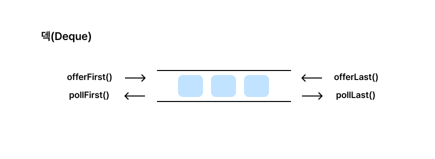

### [✏️ BFS 개념](/topics/14_bfs_dfs/bfs.md)
- [멀티 소스 BFS 개념](/topics/14_bfs_dfs/multisource_bfs.md)
- [상태 전이 BFS 개념](/topics/14_bfs_dfs/state_bfs.md)
- [백준 #2206 해설, 스레드 모델로 이해하는 BFS의 유형](/solutions/s14/G2206.md)
- [0-1 BFS, 다익스트라 + 백준 #13549 해설](/topics/14_bfs_dfs/0-1_bfs.md)

### [📁 BFS 문제 리스트](/topics/14_bfs_dfs/14_bfs_dfs.md)

# 0-1 BFS란

가중치가 **0 또는 1**만 나오는 그래프에서 **최단거리**를 구할 때 쓰는 특수한 BFS

일반 BFS는 모든 간선이 1일 때의 최단거리를 구하는 방법은 맞지만, 간선에 0이 섞이면 순서가 꼬일 수 있음

보통 BFS는 “같은 깊이 = 같은 비용”이라는 전제를 사용한다

하지만 간선의 가중치(비용)이 달라지면 깊이는 같지만 실제 비용이 더 작을 수 있다

그래서 단순한 FIFO 큐로는 “최단거리 순”이 보장되지 않는다


⇒ 이때는 `다익스트라` 또는 `0-1 BFS`를 사용한다

결론부터 말하자면 이 경우에는 **0-1 BFS** 가 더 빠르고 간단하다


## **개념**

**덱(Deque)** 을 사용



    - 양방향 큐
    - 양쪽 끝에서 삽입과 삭제를 허용하는 자료구조
- 현재 정점 u에서 이웃한 정점 v로 갈 때
    - 간선 비용이 **0**이면 v를 **덱 앞쪽**에 삽입(addFirst, offerFirst)
    - 간선 비용이 **1**이면 v를 **덱 뒤쪽**에 삽입(addLast, offerLast)
    - **‘가중치가 0인지 1인지’를 따로 변수로 저장하거나 비교하지 않고 위 규칙만으로 처리함**
- 배열 dist[]에 “현재까지 중 최단거리”를 기록하고,

  더 짧은 값으로 **갱신될 때만** 덱에 삽입

- 다음 후보를 **항상 덱의 앞에서 뽑아(pollFirst)** 최단거리를 갱신해나감 ⇒ BFS처럼 **비용 순으로 정점이 탐색됨**

> 이렇게 하면 “비용 0짜리 간선으로 더 빨리 갈 수 있는 경로”가 항상 먼저 처리되어서,
> 우선순위큐 없이도 다익스트라와 같은 효과를 낸다
> (시간복잡도 대략 **$O(V+E)$**)


## 구현 
백준 13549에 적용해보겠다

### 문제 분석

- 정점(위치): 0 ... 100_000
- 간선(이동):
    - x -> 2*x (비용 **0**)
    - x -> x-1 (비용 **1**)
    - x -> x+1 (비용 **1**)
- 목표: 시작 N에서 목표 K까지 **최단 시간**

**포인트**
- (작은 최적화) N >= K면 뒤로 가기만 하는 게 최적 → **답 = N-K** (왼쪽으로 1씩 이동)
- 그 외에는 위 3개의 이동을 갖는 그래프의 **최단거리** 문제
    - 간선 비용이 {0,1} → `0-1 BFS`을 사용

### **설계 (0-1 BFS 알고리즘 사용)**

1. 상수와 자료구조
    - MAX = 100_000
    - INF = 1_000_000_000
    - int dist[MAX+1]를 **INF**로 채우고, 시작정점 N의 거리 dist[N]=0
    - `ArrayDeque<Integer> dq = new ArrayDeque<>()`
2. 덱 초기화
    - dq.addFirst(N)
3. 덱이 빌 때까지 반복
    - x = dq.pollFirst()
    - 세 이동을 **완화**:
        - 0초 이동: nx = 2*x

          dist[nx] > dist[x]면 dist[nx]=dist[x], **앞쪽**에 넣기

        - 1초 이동들: nx = x-1, nx = x+1

          dist[nx] > dist[x]+1면 dist[nx]=dist[x]+1, **뒤쪽**에 넣기

    - 경계체크 0 <= nx <= MAX
4. x == K를 **덱에서 꺼냈을 때** dist[x]가 바로 정답

<br>

### **구현 ① 0-1 BFS**

```java
import java.io.*;
import java.util.*;

public class Main {
    static final int MAX = 100_000;
    static final int INF = 1_000_000_000;

    public static void main(String[] args) throws Exception {
        BufferedReader br = new BufferedReader(new InputStreamReader(System.in));
        StringTokenizer st = new StringTokenizer(br.readLine());
        int N = Integer.parseInt(st.nextToken()); // 시작
        int K = Integer.parseInt(st.nextToken()); // 목표

        // 쉬운 최적화: N >= K면 뒤로만 가면 됨 (순간이동은 앞쪽으로만 유리)
        if (N >= K) {
            System.out.println(N - K);
            return;
        }

        int[] dist = new int[MAX + 1];
        Arrays.fill(dist, INF);
        Deque<Integer> dq = new ArrayDeque<>();
        dist[N] = 0;
        dq.addFirst(N);

        while (!dq.isEmpty()) {
            int x = dq.pollFirst();
            if (x == K) {                // 최단거리 도달
                System.out.println(dist[x]);
                return;
            }

            // 0초 이동: x -> 2x
            int nx = x * 2;
            if (nx <= MAX && dist[nx] > dist[x]) {
                dist[nx] = dist[x];
                dq.addFirst(nx);         // 0초는 앞에!
            }

            // 1초 이동: x -> x-1
            nx = x - 1;
            if (nx >= 0 && dist[nx] > dist[x] + 1) {
                dist[nx] = dist[x] + 1;
                dq.addLast(nx);          // 1초는 뒤에!
            }

            // 1초 이동: x -> x+1
            nx = x + 1;
            if (nx <= MAX && dist[nx] > dist[x] + 1) {
                dist[nx] = dist[x] + 1;
                dq.addLast(nx);
            }
        }
    }
}
```

### **자주 하는 실수**

- visited만 쓰면 **오답** 날 수 있음. 0초 간선 때문에 나중에 더 짧은 경로가 발견될 수 있기 때문

  → **dist[nx] > 새비용인지로 갱신 체크**

- i(인덱스)와 nexts[i] (다음 위치)를 혼동할 수 있음

  → 배열 접근은 반드시 **다음 위치**로


---
## 다익스트라 버전


### 문제 요약
- 수빈이는 N번 위치에 있고, 동생은 K번 위치에 있다.
- 아래 3가지 이동이 가능:
    1. x → x * 2 : **0초** (순간이동)
    2. x → x - 1 : **1초**
    3. x → x + 1 : **1초**

- 목표: **최소 시간**


### **문제를 그래프로 바꾸면**

- 정점: 0부터 100,000까지의 위치
- 간선:
    - x → x*2: 가중치 0
    - x → x±1: 가중치 1
- **가중치가 0 또는 1인 단방향 그래프**


### **다익스트라 알고리즘 핵심 동작**

1. **우선순위 큐 사용** → 현재까지 비용이 가장 낮은 정점부터 탐색
2. 정점에 도달하는 **최단 거리 갱신** (dist[])
3. 이미 더 짧은 거리로 방문한 적 있으면 무시(갱신x)
4. 각 이동에 따른 비용 계산 후 갱신


### 코드 설명

**도달 불가를 나타내는 값**
```java
static final int MAX = 100_000;
static final int INF = 1_000_000_000;
```

- 범위는 최대 100,000까지
- INF는 초기화용. 무한대

<br>

**State 클래스**

```java
static class State {
    int x; // 현재 위치
    int d; // 시작점부터의 누적 거리 (시간)
    State(int x, int d) { this.x = x; this.d = d; }
}
```

- x: 현재 위치
- d: 현재까지 걸린 시간 (cost)
- 우선순위 큐에서 d 기준으로 정렬

<br>

**초기 세팅**

```java
int[] dist = new int[MAX + 1];       // 최단경로(시간) 저장
Arrays.fill(dist, INF);              // 모두 무한으로 초기화
PriorityQueue<State> pq = new PriorityQueue<>(Comparator.comparingInt(s -> s.d));
dist[N] = 0;                         // 시작점의 최단경로(시간)은 0초
pq.offer(new State(N, 0));
```

<br>

**다익스트라 탐색**

```java
while (!pq.isEmpty()) {
    State cur = pq.poll();
    int x = cur.x;

    // 낡은 상태 무시
    if (cur.d != dist[x]) continue;

    // 목표 도달 시 종료
    if (x == K) {
        System.out.println(dist[x]);
        return;
    }
```

- poll()로 최소 거리 정점 꺼냄
- cur.d != dist[x]이면 **더 빠른 경로가 이미 처리됨** → 무시

<br>

**이동 처리 (3가지)**

**1. 순간이동: x → 2x, 시간 0초**

```java
nx = x * 2;
if (nx <= MAX && dist[nx] > dist[x]) { // dist[nx] = dist[x] + 0
    dist[nx] = dist[x];
    pq.offer(new State(nx, dist[nx]));
}
```

**2. 뒤로 걷기:x → x-1, 시간 1초**

```java
nx = x - 1;
if (nx >= 0 && dist[nx] > dist[x] + 1) {
    dist[nx] = dist[x] + 1;
    pq.offer(new State(nx, dist[nx]));
}
```

**3. 앞으로 걷기:x → x+1, 시간 1초**

```java
nx = x + 1;
if (nx <= MAX && dist[nx] > dist[x] + 1) {
    dist[nx] = dist[x] + 1;
    pq.offer(new State(nx, dist[nx]));
}
```

<br>

**시간 복잡도**

- 정점 수: 최대 100,001
- 간선 수: 각 정점에서 최대 3개 → 대략 3 * 10^5
- 우선순위 큐 사용 → O(E log V) ≈ O(3*10^5 * log 10^5) → 충분히 통과

<br>

### **구현 ② 다익스트라 버전**


```java
import java.io.*;
import java.util.*;

public class Main {
    static final int MAX = 100_000;
    static final int INF = 1_000_000_000;

    static class State {
        int x;
        int d; // 시작점부터의 거리
        State(int x, int d) { this.x = x; this.d = d; }
    }

    public static void main(String[] args) throws Exception {
        BufferedReader br = new BufferedReader(new InputStreamReader(System.in));
        StringTokenizer st = new StringTokenizer(br.readLine());
        int N = Integer.parseInt(st.nextToken()); // 시작
        int K = Integer.parseInt(st.nextToken()); // 목표

        if (N >= K) {
            System.out.println(N - K);
            return;
        }

        int[] dist = new int[MAX + 1];
        Arrays.fill(dist, INF);
        PriorityQueue<State> pq = new PriorityQueue<>(Comparator.comparingInt(s -> s.d));
        dist[N] = 0;
        pq.offer(new State(N, 0));

        while (!pq.isEmpty()) {
            State cur = pq.poll();
            int x = cur.x;
            if (cur.d != dist[x]) continue; // 낡은 상태 무시
            if (x == K) {                   // 최단 도착
                System.out.println(dist[x]);
                return;
            }

            // x -> 2x (0)
            int nx = x * 2;
            if (nx <= MAX && dist[nx] > dist[x]) {
                dist[nx] = dist[x];
                pq.offer(new State(nx, dist[nx]));
            }

            // x -> x-1 (1)
            nx = x - 1;
            if (nx >= 0 && dist[nx] > dist[x] + 1) {
                dist[nx] = dist[x] + 1;
                pq.offer(new State(nx, dist[nx]));
            }

            // x -> x+1 (1)
            nx = x + 1;
            if (nx <= MAX && dist[nx] > dist[x] + 1) {
                dist[nx] = dist[x] + 1;
                pq.offer(new State(nx, dist[nx]));
            }
        }
    }
}
```

---

# 0-1 BFS vs 다익스트라, 어떤 걸 쓰면 좋을까?

> 간선 가중치가 0 또는 1밖에 없다면, 0-1 BFS가 다익스트라보다 훨씬 빠르고 가볍다

- 간선 가중치가 **0/1**뿐 → **0-1 BFS**가 간단하고 빠름 (코드도 짧고, O(V+E)).
- 가중치가 다양한 **양의 정수** → **다익스트라**

둘 다 “**dist 갱신 시에만 큐/덱에 넣는다**”가 핵심

<br>

## 비교

| **항목** | **0-1 BFS** | **다익스트라** |
| --- | --- | --- |
| **간선 가중치 조건** | 0 또는 1만 가능 | 0 이상이면 모두 가능 |
| **시간복잡도** | O(V + E) | O(E log V) |
| **자료구조** | Deque | PriorityQueue (힙) |
| **속도** | 더 빠름 (특화 알고리즘) | 상대적으로 느림 |
| **코드 난이도** | 약간 트릭 있음 (addFirst/addLast) | 일반적이고 직관적 |
| **사용 케이스** | 0-1 가중치 문제에서 최강 | 모든 일반 그래프 |

### **1. 우선순위 큐 연산이 없음**

- 다익스트라는 항상 log V짜리 힙 연산이 필요
- 0-1 BFS는 그냥 **덱 앞/뒤에 삽입만** 하니까 **O(1)임**

### **2. 비용 순서대로 자동 정렬됨**

- 순간이동(0초)은 addFirst → **가장 먼저 꺼내짐**
- 걷기(1초)는 addLast → **나중에 꺼내짐**

별도로 정렬하거나 비교하지 않아도, 덱 구조만으로 **비용 순 처리**

### **3. 간선 가중치가 0/1일 때에만 특화됨**

- **다익스트라는 일반 그래프용(가중치 0 이상) 범용 알고리즘**
- 반면, **0-1 BFS는 이 특수한 케이스에만 최적화**되어 있음

## 결론

‘가중치가 0 또는 1’일 때는 0-1 BFS가 훨씬 더 빠르고 효율적이다.

다익스트라는 가중치 0 이상의 그래프에 모두 쓸 수 있는 범용 알고리즘이고,

0-1 BFS는 이 조건에 맞춘 **특수한 최적화 버전**이다