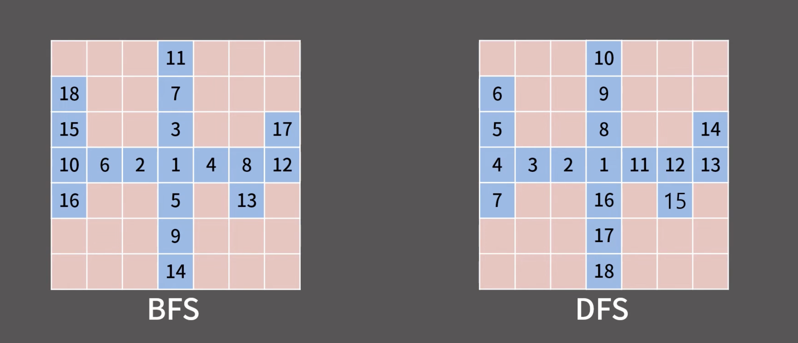

# DFS (Depth-First Search)

다차원 배열의 순회를 처리하는 알고리즘

1. 시작하는 칸을 스택에 넣고 방문했다는 표시를 남김
2. 스택에서 원소를 꺼내어 그 칸과 상하좌우로 인접한 칸에 대해 3번을 진행
3. 해당 칸을 이전에 방문했다면 아무 것도 하지 않고, 처음으로 방문했다면 방문했다는 표시를 남기고 해당 칸을 스택에 삽입
4. 스택이 빌 때까지 2번을 반복
모든 칸이 스택에 1번씩 들어가므로 시간복잡도는 칸이 N개일 때 O(N)

그냥 BFS와 똑같은데 큐 대신 스택을 사용

그럼 어뜨케 한 깊이로 끝까지 파고든다는걸까?
LIFO니까..
당연하겠지..
자기 인접들만 넣고 빼고 넣고 빼면서 인접들이 바닥날 때까지 반복하니까


어디에 사용할까?

<br>

## 유형

Flood Fill

<br>

## 구현
템플릿

```java
import java.io.*;
import java.util.*;

public class DFS {
    static int n = 7, m = 10;
    static int[][] board = new int[502][502];
    static boolean[][] vis = new boolean[502][502];
    static int[] dx = {1, 0, -1, 0};
    static int[] dy = {0, 1, 0, -1};

    public static void main(String[] args) throws IOException {
        BufferedReader br = new BufferedReader(new InputStreamReader(System.in));

        // 예시 초기화
        for (int i = 0; i < n; i++)
            Arrays.fill(board[i], 1);

        Deque<int[]> stack = new ArrayDeque<>();
        vis[0][0] = true;
        stack.push(new int[]{0, 0}); // push = addFirst

        while (!stack.isEmpty()) {
            int[] cur = stack.pop(); // pop = removeFirst
            int x = cur[0], y = cur[1];
            System.out.print("(" + x + ", " + y + ") -> ");

            for (int dir = 0; dir < 4; dir++) {
                int nx = x + dx[dir];
                int ny = y + dy[dir];

                if (nx < 0 || ny < 0 || nx >= n || ny >= m) continue;
                if (vis[nx][ny] || board[nx][ny] != 1) continue;

                vis[nx][ny] = true;
                stack.push(new int[]{nx, ny});
            }
        }
    }
}
```

스택의 구현체는 당연히 ArrayDeque다
자바의 Stack 클래스는 옛날 컬렉션인 Vector 기반이기 때문임
그리고 synchronized 동기화를 사용해서 락 오버헤드도 발생한다

<br>

## BFS와의 비교

bfs와 dfs의 방문 순서를 비교해보자



BFS
- 거리순으로 방문
- 현재 정점(poll)에 의해 추가(offer)되는 인접 정점은 현재 정점의 거리보다 1 큰 거리를 갖는다

DFS
- 한 깊이로 최대까지 파고 들어가는 것을 알 수 있다
- 현재 정점(poll)에 의해 추가(offer)되는 인접 정점은 현재 정점의 거리보다 1 큰 거리를 갖는다 -> 이 룰이 성립하지 않음
-> 거리 계산에 사용할 수 없음

Flood Fill은 BFS/DFS 어느 것을 사용해도 똑같은 결과를 내기 때문에
BFS 대신 DFS를 쓸 이유가 없다(메리트가 없음)

따라서 다차원 배열의 탐색(및 순회) 문제는 BFS를 사용

DFS는 언제 쓰는가?
그래프와 트리에서 쓴다(나중에 추가할 것임)
