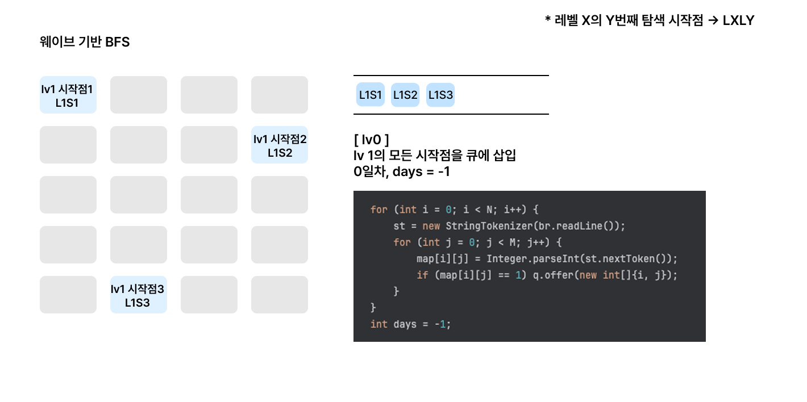
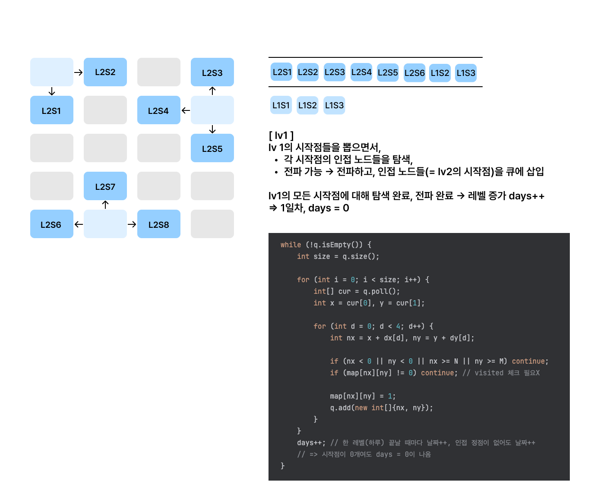
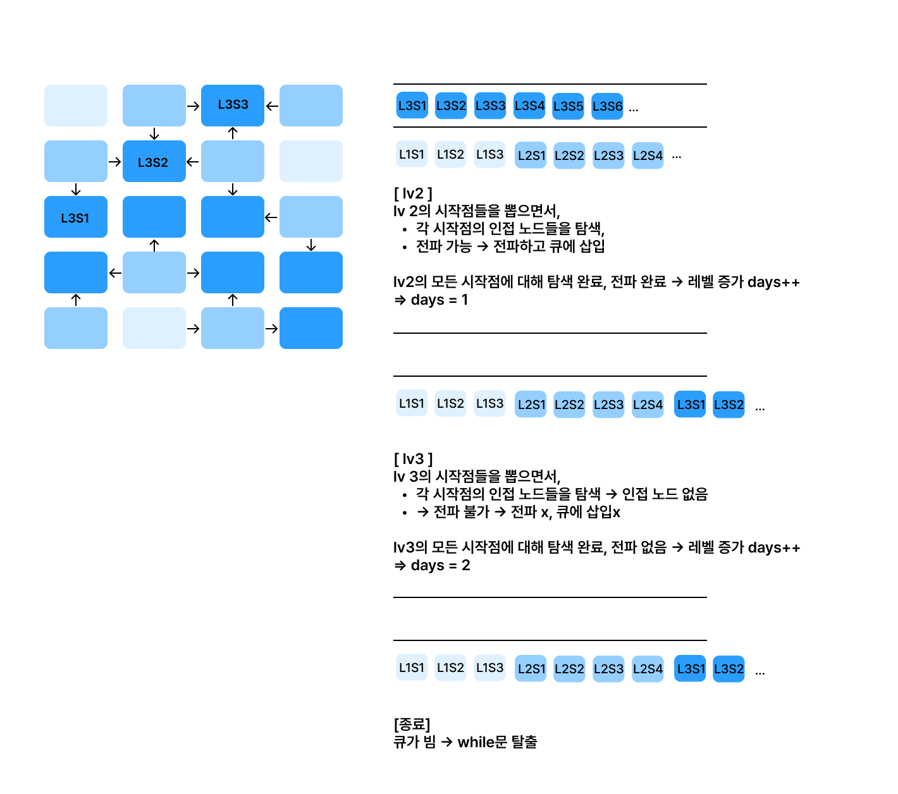
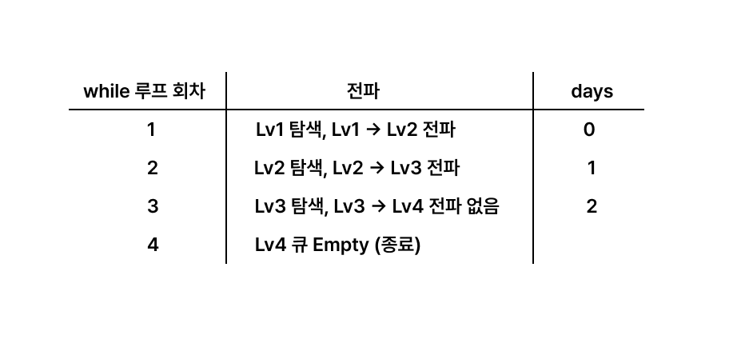
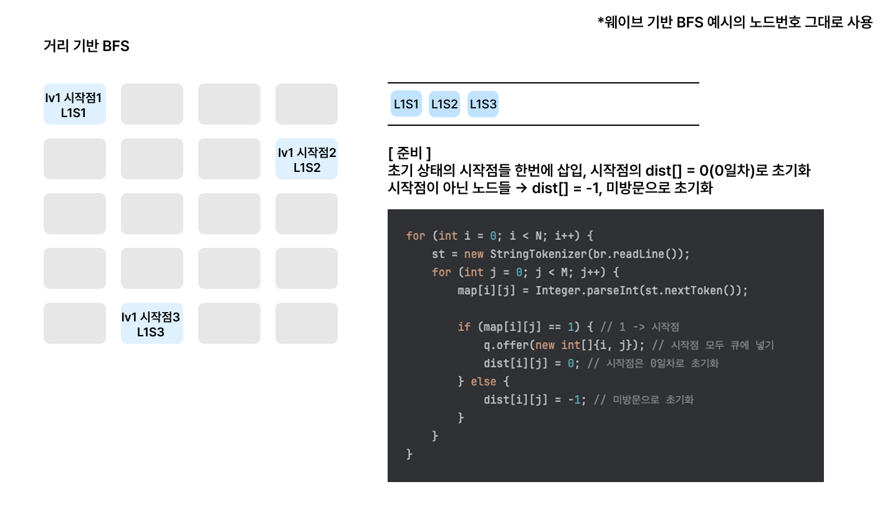
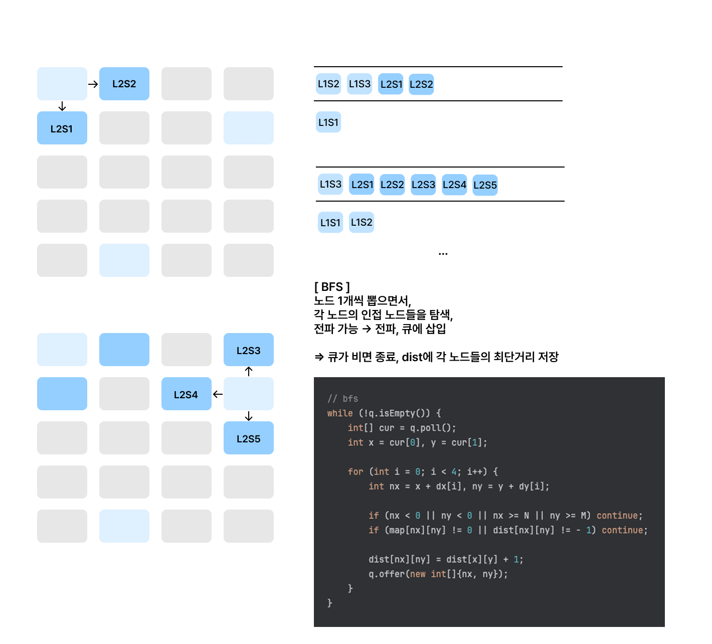
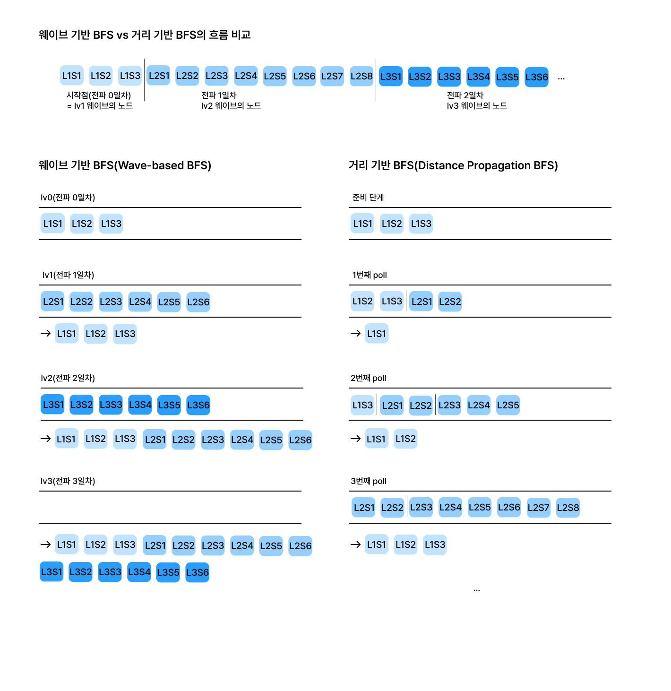

# 멀티소스 BFS

## 1. 핵심 아이디어
- 일반 BFS: 시작점 1개, 시작점에서 출발 → 인접 노드 순차 탐색
- 멀티소스 BFS: 시작점 여러 개를 **동시**에 큐에 넣고 시작하는 BFS

⇒ BFS가 진행되면서 모든 시작점에서 같은 속도로 동시에 탐색됨

이 멀티소스 BFS를 구현하는 방법으로는 전파 단위에 따라
1. 웨이브 기반 BFS(days 방식), 2. 거리 기반 BFS(dist 방식) 두 가지가 대표적이다 <br>

💡참고로, 전파 BFS는 멀티소스(시작점이 여러개)가 아닌 일반 BFS에서도 쓰이는 패턴이다  <br>

|           | 웨이브 기반 BFS(days 방식)                | 거리 기반 BFS(dist 방식)                           |
|-----------|------------------------------------|----------------------------------------------|
| 전파 구조     | 모든 노드가 동일한 공동 시간선에서, 동시에 진행        | 각 노드가 독립적으로 거리(시간)을 갱신                       |
| 시간 단위의 표현 | 전역 변수(days) 하나로 통합 관리              | 각 노드의 거리 dist[x][y]로 개별 관리                   |
| 큐 처리 단위   | size = q.size() → 현재 웨이브(레벨) 전체 처리 | 개별 노드를 poll, 인접 노드 탐색 후 전파                   |
| 레벨 증가의 시점 | 한 레벨의 모든 노드(시작점)가 전파 완료된 후에 증가     | 인접 노드를 방문하는 즉시 dist[nx][ny] = dist[x][y] + 1 |
| 관점        | 전체 레벨(공통 타임라인)에서의 단위 시간 변화         | 개별 노드의 **거리 변화**                             |

 <br>

## 2. 유형
- 여러 지점에서 동시에 전파/확산되는 현상
- 여러 출발점에서 목표까지 최단거리 계산
- ex. 토마토가 동시에 익기 시작 (7576)
  <br> 불이 동시에 퍼지기 시작 (4179)

 <br>

## 3. 탐색 패턴

### 1. 웨이브 기반 BFS (Level-order BFS, Wave-based BFS)
"**전역 변수 days를 사용해 레벨 관리, 한 웨이브 단위로 전파**" <br>
- 한 큐를 기준으로 현재 레벨의 모든 노드를 동시에 처리하고, 
- 한 바퀴 끝날 때마다 레벨을 증가시킨다(days++) 
- 한 웨이브(레벨)의 모든 노드(시작점)에 대해 인접 노드를 탐색하고, 인접 노드로 전파를 끝내면 days를 1 증가시킨다 

**전체가 하나의 “공통의 타임라인”에서 진행된다** 


*Frame 5–8: Wave-based BFS(days) — 전역 타임라인 상의 레벨 증가 예시*  




레벨의 변화 <br>



**로직**
1. 준비 단계
   - lv 0: 초기 상태의 시작점 여러개를 모두 삽입
   - days = -1로 초기화
2. while (!q.isEmpty()) → 레벨 단위 반복 (lv1 ~ lv_end + 1) <br>
   1. 현재 큐 크기(q.size) = 현재 레벨에서 처리할 시작점의 개수 <br>
   2. for (; i < size;) → 현재 레벨의 시작점들 n개에 대해 반복 <br>
      1. 현재 레벨의 시작점 n개를 하나씩 꺼내 반복
      2. 각 시작점에 대해
         3. 시작점 꺼내기 → lv cur의 시작점 1개
         2. for (시작점의 인접 노드들) → lv cur의 시작점 1개의 "인접들"을 **탐색**
            - 시작점의 인접 노드들을 **탐색**
            - 조건 체크하고, 전파 가능하면 **전파** → 큐에 삽입
            - 전파된(새로 큐에 삽입된) 노드들은 **다음 레벨의 시작점**이 됨
   3. 현재 레벨의 모든 시작점 **탐색** 완료 → **레벨 증가, days++**
      <br> 💡전파가 되지 않았어도 탐색은 했기 때문에 레벨이 증가한다
   4. 큐가 비면 while문 탈출
      <br> 탐색이 **end**일째에 종료 → 레벨은 lv1부터 lv end+1까지 진행
      <br> 마지막 탐색이 종료된 후의 days 값 -> 전파에 걸린 일수
3. 조건에 맞게 출력 (문제에 따라 days, dist, 플래그등 조합해 재량껏 커스텀)

웨이브: BFS에서 현재 상태에서 큐의 모든 원소를 처리하는 단위를 말한다

 <br>

**웨이브 기반 BFS 구현 예시** 

````java
import java.io.*;
import java.util.*;

public class WaveBasedBFS {
    static int N, M;
    static int[][] board;
    static int[] dx = {1, 0, -1, 0};
    static int[] dy = {0, 1, 0, -1};

    public static void main(String[] args) throws IOException {
        BufferedReader br = new BufferedReader(new InputStreamReader(System.in));
        StringTokenizer st = new StringTokenizer(br.readLine());
        N = Integer.parseInt(st.nextToken()); // 행
        M = Integer.parseInt(st.nextToken()); // 열
        board = new int[N][M];

        for (int i = 0; i < N; i++) {
            st = new StringTokenizer(br.readLine());
            for (int j = 0; j < M; j++) {
                board[i][j] = Integer.parseInt(st.nextToken());
            }
        }

        // 멀티 소스 BFS 시작
        Queue<int[]> q = new ArrayDeque<>();
        for (int i = 0; i < N; i++) {
            for (int j = 0; j < M; j++) {
                if (board[i][j] == 1) {   // 시작점 여러 개
                    q.offer(new int[]{i, j}); // 모두 삽입. 동시
                }
            }
        }

        int days = -1;  // 시작일 보정
        while (!q.isEmpty()) {
            int size = q.size();   // 현재 레벨(지금 시점)에 처리할 노드 수(시작점)

            for (int s = 0; s < size; s++) {
                int[] cur = q.poll();
                int x = cur[0], y = cur[1];

                for (int dir = 0; dir < 4; dir++) {
                    int nx = x + dx[dir];
                    int ny = y + dy[dir];

                    if (nx < 0 || ny < 0 || nx >= N || ny >= M) continue;
                    if (board[nx][ny] != 0) continue;

                    board[nx][ny] = 1; // 방문 처리
                    q.offer(new int[]{nx, ny});
                }
            }
            days++; // 현재 레벨 끝 → 레벨 증가
        }

        System.out.println(days);
    }
}
````
<br>

**레벨 진행에 따른 큐의 상태**
````
Day 0: [S1, S2, S3]   ← 시작점 모두 큐에 들어있음
Day 1: [S1의 인접들, S2의 인접들, S3의 인접들]
Day 2: [Day1에서 전파된 것들 전부의 인접들]
...
````
- 각 레벨마다 그 레벨의 시작점에 해당하는 정점들이 들어있다는 것을 알 수 있음
- 즉, BFS의 “레벨(Level)” = “날짜/시간 단위”
- 멀티소스 BFS = 시작점 여러 개로 레벨 BFS 돌리기

<br>

**포인트**
1. days = -1로 초기화
- 멀티소스 BFS의 **진입 시점**은 시작점들을 이미 큐에 다 넣고 시작 → Day 0 상태
- 따라서 while 루프 1회 끝났을 때 = 시작한 레벨이 종료 = 실제 Day 1
  <br> → days = -1로 시작하면, 마지막에 보정된 값이 정확히 맞음

2. 큐의 초기화 시점
```java
for (시작점 s : 시작점들) {
    q.offer(s);
    dist[s] = 0;
}
```
- 같은 레벨의 시작점 여러개를 동시에 모두 큐에 삽입해야 함 → 동시성을 보장

3. 레벨 단위 처리
````java
int size = q.size();   // 시작점의 개수
for (int i = 0; i < size; i++) {
    // 현재 레벨에서 전파할 인접 노드들 처리
}
days++; // 레벨 증가
````

<br>

### 2. 거리 기반 BFS(Distance Propagation BFS, Node-based BFS)
"**각 노드의 최단거리를 dist 배열에 저장, 스트림별(A시작 스트림, B시작 스트림,..) 개별적인 흐름으로 전파**" <br>
큐의 노드 하나씩을 탐색, 전파하며 스트림별로 진행, 중지, 종료되며 진행하는 방식이다 <br>
각 노드는 방문 시점에 거리(또는 시간)을 기록해 자신의 “전파된 거리(dist)”를 독립적으로 관리한다 <br>
즉, 각 노드는 자체적인 레벨(거리)을 가지며 런타임 상에서 스트림별 BFS 파동이 겹치는 형태이다 <br>
dist 방식은 BFS의 구현 패턴으로, "시작점이 여러개"라는 조건(멀티 소스 BFS)에서도 하나의 구현 방법으로 사용하는 것이다 <br>
👉 단일 출발/멀티소스 + 최단거리형 → dist

- 각 노드의 도달 거리를 기록 (dist[nx][ny] = dixt[x][y] + 1)하며, 이는 **최단거리**이다
- 단점 : 배열이 추가되어 공간 소모가 조금 증가

<br>

*Frame 9–11: Distance-based BFS(dist) — 각 노드별 독립적인 거리 전파 흐름*



 <br>

**웨이브 기반 BFS 패턴과의 차이점** <br>
dist는 각 노드별로 개별적으로 탐색과 전파를 진행하며 전파되는 경우 이전 레벨보다 거리를 증가시킨다 <br>
따라서, 전파가 종료된 후 dist에 저장된 수가 그대로 최단거리(날짜)가 된다 <br>
반면, 웨이브 기반 BFS 전역적으로 레벨을 증가시키는 패턴으로, 마지막 전파 후 days에 저장된 숫자는 “전파 횟수 - 1”이다 <br>
그리고 전파가 없는 탐색이 한 번 더 일어난 후 days가 1 증가되어 실제 전파 횟수(날짜)가 된다 <br>

dist는 “개별 칸의 익은 날짜” → 마지막 익은 칸의 값이 days의 실제 일수와 같기 때문에 days보다 흐름의 이해가 쉽다


<br>


**포인트** <br>
시작점이 1개인 일반 BFS에서와 다르게, 초기 상태의 모든 시작점을 큐에 넣고 시작한다는 점만 다름 

 <br>

### 웨이브 기반 BFS vs 거리 기반 BFS의 큐 상태 비교



<br>

## 4. 요약
- 시작점이 여러 개일 때 큐에 동시에 넣는 것이 중요하다.
- BFS는 원래 레벨 순서 탐색이므로, 시작점을 여러 개 넣으면 자동으로 “동시 전파”가 구현된다.
- 날짜/시간 같은 단위가 필요할 땐 for문으로 현재 레벨만큼만 처리 → days++ 패턴을 쓰면 된다.
   - days = -1 의 패턴은 “시작 상태를 0일차로 맞추기” 위한 것.

<br>

## 정리
멀티소스 BFS란 <br>
시작점 여러 개를 동시에 & 모두 큐에 넣고, <br>
BFS를 레벨 단위로 돌려서 “동시에 확산/전파되는 효과”를 구현하는 알고리즘 <br>
